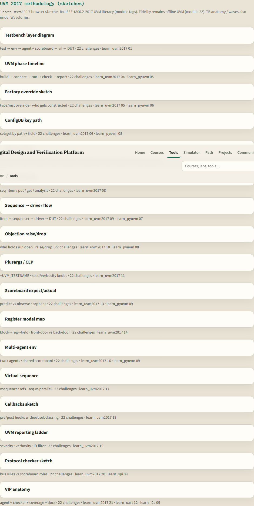

# Welcome to UVM 2017 methodology

Verification at block and chip level needs structure, not only a DUT and a few directed tests

---

## Why layered testbenches matter
- As designs grow, you need reusable agents, predictable phase order
- A flat procedural testbench can work for a tiny block, but it breaks when teams, protocols
- UVM gives you a shared vocabulary for environments, sequences, configuration

---

## Two tracks, one idea
- Every lab module offers two ways to practice
- Makefile runs feel like work you will keep
- Agent intuition without installing UVM
- You may do either track, or both
- The usual rhythm is browser first for the idea, then offline runs for fidelity

---

## Set up the real UVM track
- Obtain a UVM library and a simulator that can run it
- Open the in-course hello linked from this repo
- Confirm you can compile and run a small testbench once
- Module twenty-two in this course is the dedicated offline run

---

## Set up the browser lab track

---

## How to move through modules
- For each module
- Python pyuvm is a separate course; this path stays with SystemVerilog UVM twenty seventeen
- When you finish this intro checklist, continue to the first lab module: testbench layers

