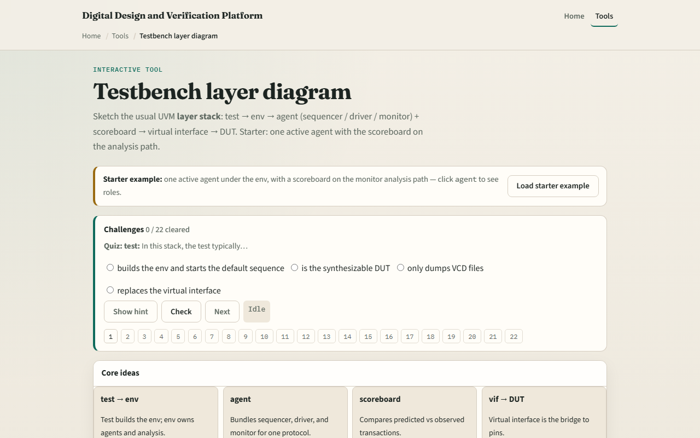
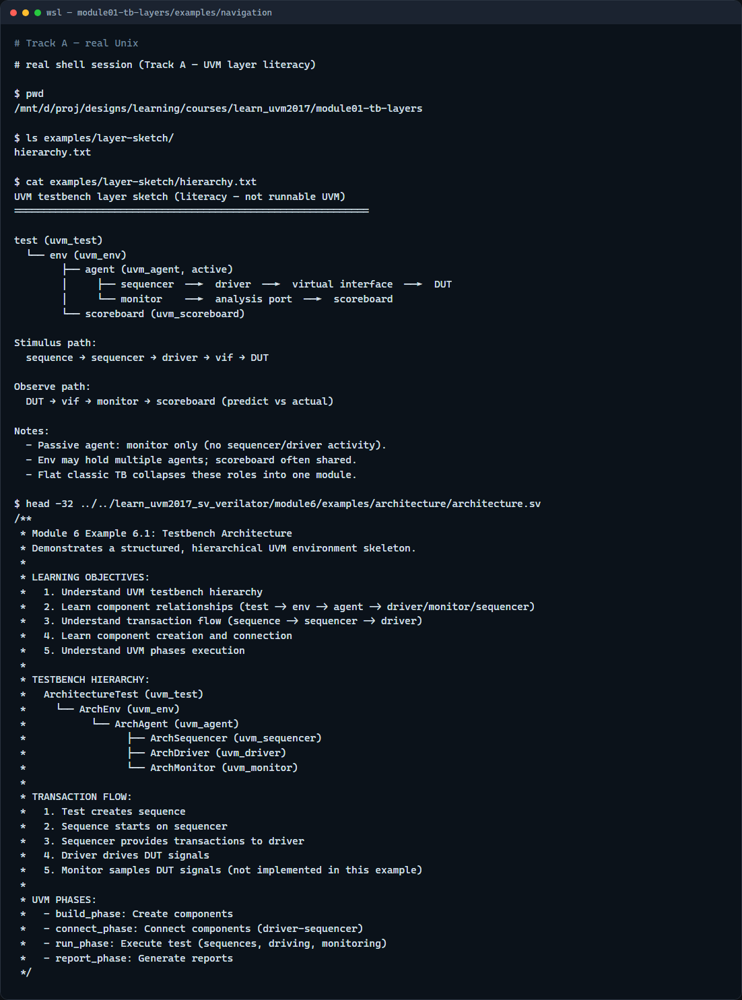

# Module 01 — TB layers

**Module id:** module01-tb-layers  
**Lab:** tb-layers  
**Tracks:** A · B

## Slide 1 — TB layers

Before you memorize UVM macros, you need a map of the testbench stack. This module is that map: which layers sit above the DUT, who owns whom, and how stimulus and checking flow through the hierarchy. We will use the browser lab for the picture, then point at the same shape in real UVM source.

## Slide 2 — Test, env, agent, and the DUT

At the top sits the test—it builds the environment and kicks off sequences. The environment holds agents and usually a scoreboard. Each agent bundles a sequencer, a driver, and a monitor around one protocol. The driver pushes transactions through a virtual interface into the DUT; the monitor watches the same interface and publishes what it saw. The scoreboard compares predict versus observe. Two paths matter: stimulus runs sequence to sequencer to driver to interface to DUT; observation runs DUT to interface to monitor to scoreboard. A flat procedural testbench collapses those roles into one module—UVM separates them so teams can reuse and scale.

## Slide 3 — Browser lab

In the browser lab track, open the testbench layer diagram lab from the tools page. You will see a block picker, a preset menu, and a diagram that highlights the path from test down to the DUT. Load the starter preset—one active agent plus scoreboard—and click a few blocks to see stimulus versus observe highlighted. Try the dual-agent or passive presets so you feel how the env container grows. Work a few challenges, then use Check when your selection matches the prompt. The lab teaches the layout; you do not need a full UI tour here.

## Slide 4 — Real UVM literacy

In the real UVM track, open this module’s examples folder and read the hierarchy sketch—it mirrors the browser diagram in plain text. If you have the in-course hello checked out next door, peek at the architecture example header: same test, env, agent, sequencer, driver, monitor story in real SystemVerilog comments. You are not compiling UVM yet; you are learning to read the stack before you run Make.

## Slide 5 — Pitfalls to watch

Do not confuse the test with the environment—the test is thin; the env owns structure. Do not assume every agent is active—a passive agent monitors only and has no driver path. An env without a scoreboard can still stimulate, but nobody compares results—that is incomplete checking, not a shortcut. And remember: the browser sketch is literacy; Accellera UVM plus your simulator is where fidelity lives.

## Slide 6 — Your turn

Complete the checklist for at least one track—preferably both. In the browser, load the starter and finish a few challenges. On real UVM, restate the two paths—stimulus and observe—in your own words and skim one offline example. When you are ready, take the short quiz, then continue to basic testbench versus UVM map in the next module.
