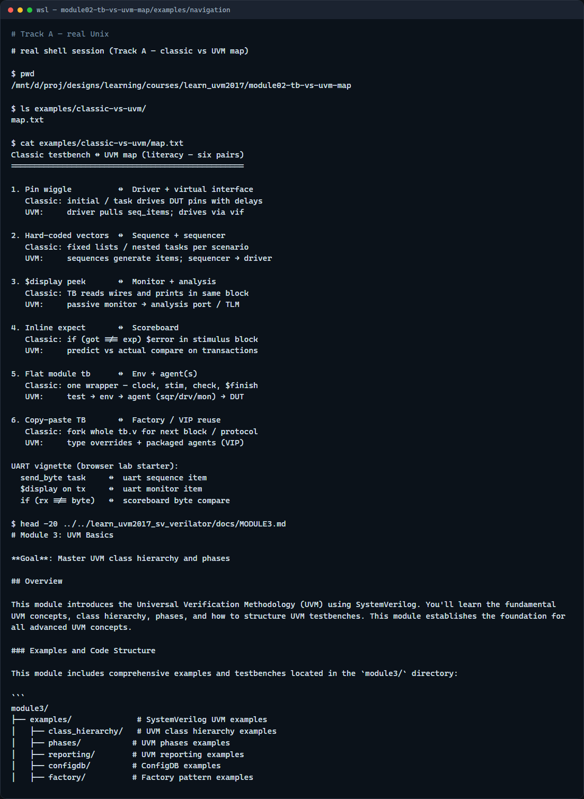

# Module 02 — Basic TB vs UVM map

**Module id:** module02-tb-vs-uvm-map  
**Lab:** tb-vs-uvm-map  
**Tracks:** A · B

## Slide 1 — Basic TB vs UVM map

You already know how a small block testbench wiggles pins, prints values, and checks results in one module. UVM does not throw that away—it reorganizes the same jobs into named roles you can reuse. This module is the translation chart: classic testbench habit on one side, UVM counterpart on the other. We will use the browser lab for the pairs, then anchor them in notes you can carry offline.

## Slide 2 — Six pairs to memorize

Think in six mappings. Pin wiggle in an initial block becomes a driver behind a virtual interface. Hard-coded vectors and nested tasks become sequences feeding a sequencer. A display peek in the same initial becomes a monitor on an analysis path. Inline expect becomes a scoreboard comparing predict versus actual on transactions. One flat testbench module becomes test, environment, and agents around the DUT. Copy-paste the whole bench for the next block becomes factory overrides and packaged agents—a VIP mindset. Same verification work; different containers so teams can share pieces.

## Slide 3 — Browser lab

In the browser lab track, open the basic testbench versus UVM map lab. You will see classic and UVM columns, six clickable pairs, and a protocol vignette—UART transmit is the starter. Load the starter example so pin-drive maps to driver plus interface are already selected. Click through stimulus, observe, check, structure, and reuse to read each bridge sentence. Mark pairs mapped when the idea clicks, work a few challenges, then use Check. The lab is side-by-side literacy—not a simulator run.

## Slide 4 — Real UVM literacy

In the real UVM track, open this module’s examples folder and read the six-pair map—it mirrors the browser table in plain text. For each classic habit, say the UVM role aloud before you open source code. If the legacy offline course is checked out next door, skim any example where a driver converts items to pin activity—that is the pin-wiggle pair in real SystemVerilog. You are building a mental Rosetta stone, not running a full regression yet.

## Slide 5 — Pitfalls to watch

Do not treat UVM as magic that replaces thinking—you still need stimulus, observation, and checks. Do not map only the driver and skip the monitor; observation split from stimulus is the whole point. Do not assume every project needs every UVM feature—a tiny block may stay classic until reuse pressure appears. And remember: the browser lab does not execute Accellera UVM; it teaches names and relationships before your Makefile does the heavy lifting.

## Slide 6 — Your turn

Complete the checklist for at least one track—preferably both. In the browser, map all six pairs on the UART starter, then try another protocol vignette if you are curious. On real UVM, restate the six mappings without looking at the cheat sheet. When you are ready, take the short quiz, then continue to testbench anatomy refresh in the next module.
