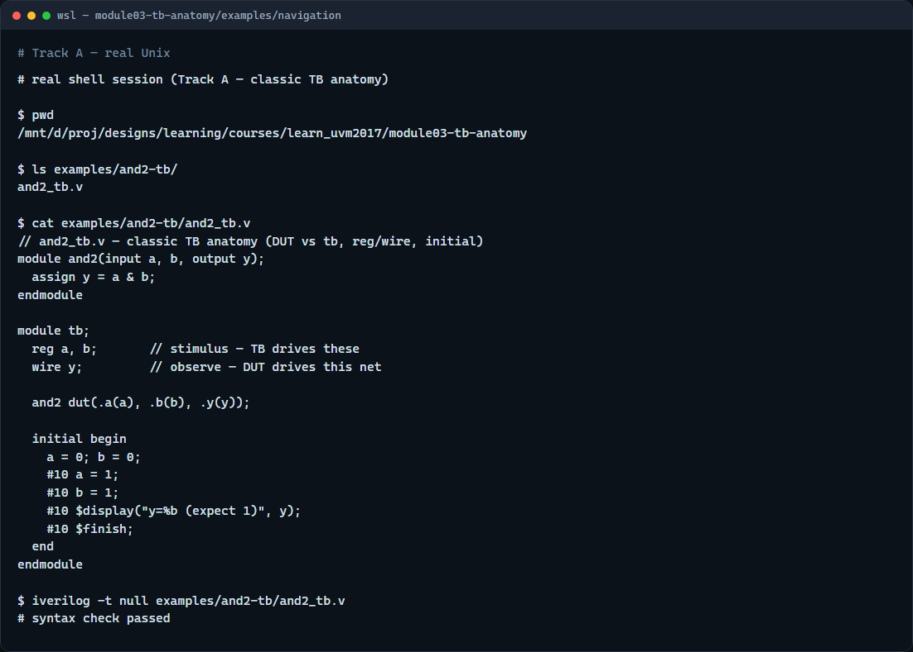

# TB anatomy refresh

Before UVM classes and phases, every verification engineer meets the same classic picture

---

## DUT, tb, reg, wire, initial
- The DUT is synthesizable RTL, the block you are verifying
- The testbench module is simulation-only
- Stimulus inputs are typically reg because the testbench assigns them in an initial or
- Outputs you observe are wire or logic nets driven by the DUT
- An initial block advances time with delays, prints with display, and stops with finish
- That five-part split

---

## Browser lab

---

## Real testbench file

---

## Pitfalls to watch
- Do not drive a wire the DUT also drives, that creates a contention error
- Do not put synthesizable checks only in the testbench and forget what the RTL actually
- Do not skip finish in long runs unless you know the simulator will stop another way
- And remember

---

## Your turn
- Complete the checklist for at least one track, preferably both
- In the browser, step the timeline and finish a few challenges
- On real SystemVerilog
- When you are ready, take the short quiz, then continue to UVM phases in the next module

