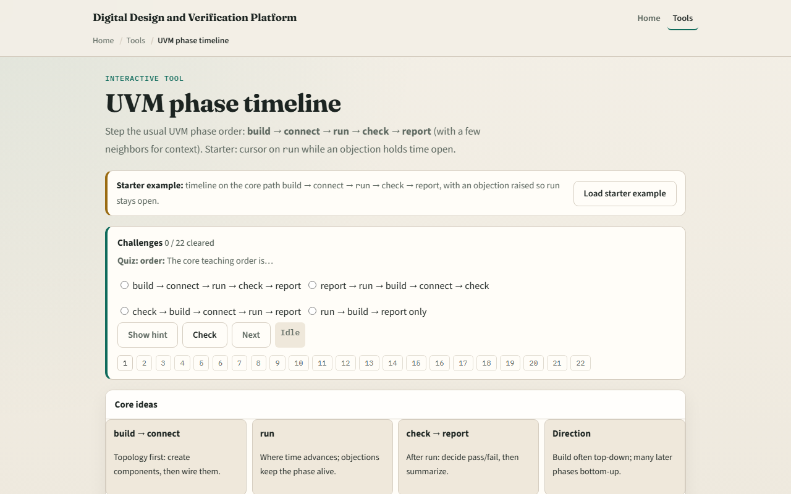
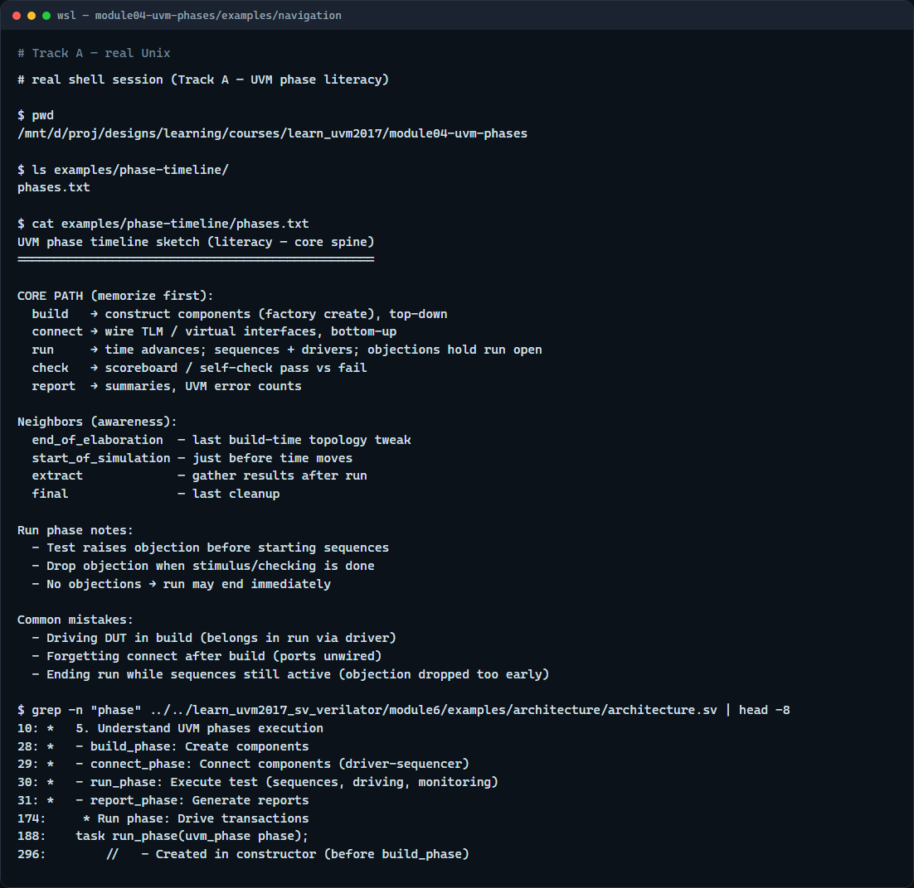

# UVM phases

UVM does not run your whole testbench in one initial block

---

## Build, connect, run, check, report
- Build constructs the component tree
- Connect wires TLM ports and virtual interfaces, usually bottom-up after everything exists
- Run is where time advances
- When all objections drop, run ends and cleanup phases run
- Check is where scoreboards and self-checks decide pass versus fail
- Report prints summaries and error counts

---

## Browser lab

---

## Real UVM literacy

---

## Pitfalls to watch
- Do not drive the DUT in build, build is for construction and configuration, not time
- Do not forget objections in run
- Do not assume connect and build walk the same direction
- And remember

---

## Your turn
- Complete the checklist for at least one track, preferably both
- In the browser, load the starter, walk the core five phases, and finish a few challenges
- On real UVM, recite build through report from memory and note where objections belong
- When you are ready, take the short quiz, then continue to the factory in the next module

