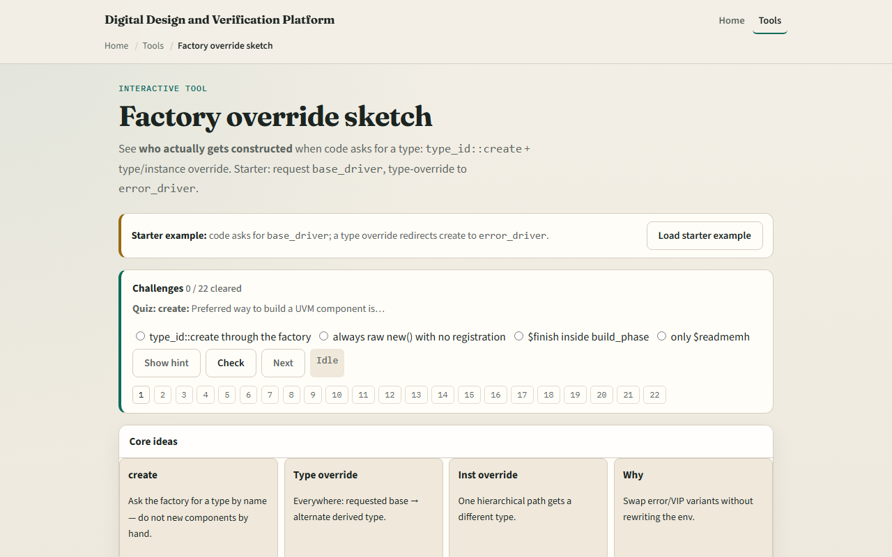
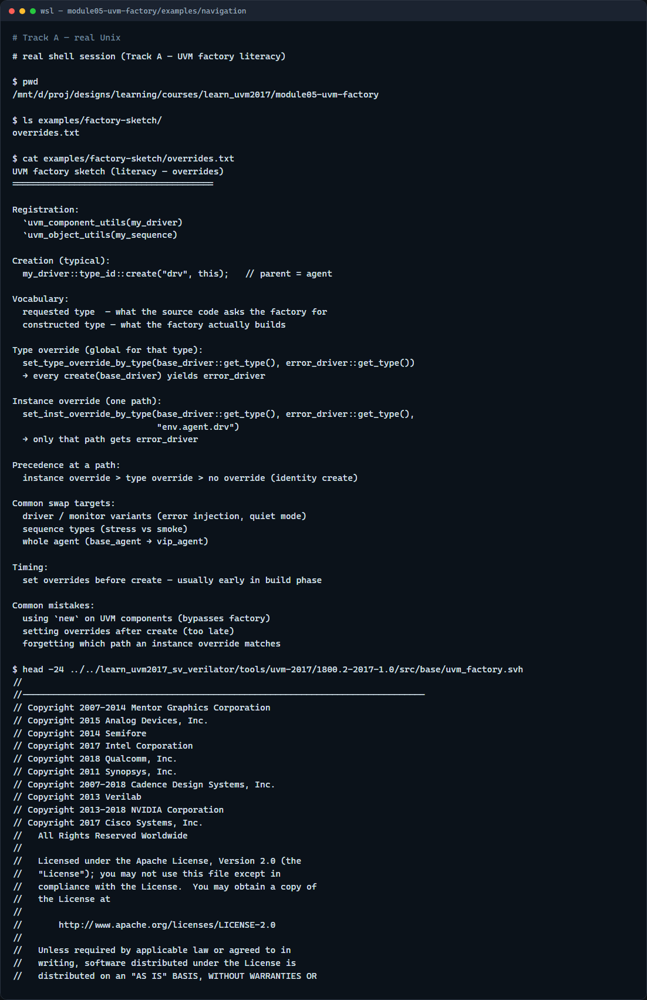

# Module 05 — UVM factory

**Module id:** module05-uvm-factory  
**Lab:** uvm-factory  
**Tracks:** A · B

## Slide 1 — UVM factory

UVM builds most testbench objects through a factory—not with bare new everywhere. That indirection lets you swap drivers, sequences, or whole agents without rewriting the hierarchy. This module is factory literacy: requested type versus constructed type, type override versus instance override. We will use the browser lab for the picture, then anchor the same rules in notes you can read offline.

## Slide 2 — Create, type override, instance override

Registration macros put each class on the factory menu. Creation asks for a type by name or type handle—typical pattern is type_id create with a parent component. A type override says whenever anyone requests base driver, build error driver instead—every path gets the swap. An instance override targets one hierarchy path—only env dot agent dot drv gets the special driver. If both apply at the same path, instance wins. Sequences and agents follow the same idea: stress sequence instead of base sequence, VIP agent instead of base agent. The hierarchy source still says base driver; the factory decides what you actually get.

## Slide 3 — Browser lab

In the browser lab track, open the factory override sketch lab. You will see requested type, instance path, override tables, and the constructed result. Load the starter preset—base driver with a type override to error driver. Press create and read which type was built and why. Try the instance override preset to see path-specific winning over type. Swap the sequence or agent presets if you want the same pattern on a different component kind. Work a few challenges, then Check. The lab teaches override rules—not a full compile.

## Slide 4 — Real UVM literacy

In the real UVM track, open this module’s examples folder and read the override sketch—it lists registration, create, type override, and instance override in plain language. Say aloud: requested type is what the code asks for; constructed type is what the factory builds. If the legacy offline course is checked out, grep for set type override or factory create in any example—you will meet the same vocabulary in SystemVerilog. You are learning swap points before you debug a wrong driver in a regression.

## Slide 5 — Pitfalls to watch

Do not bypass the factory with new on UVM components—you lose override hooks. Do not set overrides after the object is already constructed—register overrides before create in build phase. Do not confuse type and instance overrides—instance is narrower and wins at a matching path. And remember: the browser sketch does not run Accellera UVM; offline plusargs and test code still matter for real swaps.

## Slide 6 — Your turn

Complete the checklist for at least one track—preferably both. In the browser, run create on the starter and explain the constructed type without looking. On real UVM, sketch one type override and one instance override for a driver swap. When you are ready, take the short quiz, then continue to ConfigDB in the next module.
