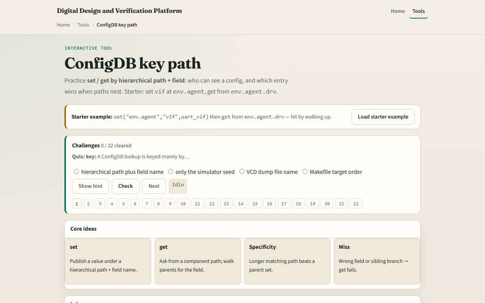
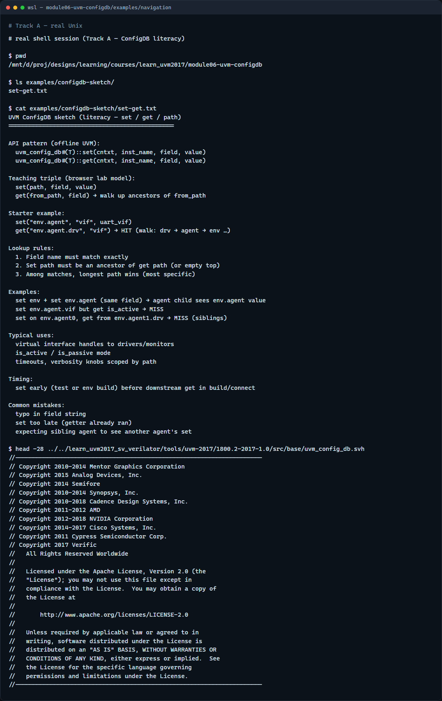

# Module 06 — ConfigDB

**Module id:** module06-uvm-configdb  
**Lab:** uvm-configdb  
**Tracks:** A · B

## Slide 1 — ConfigDB

After the factory builds your tree, components still need configuration—virtual interfaces, active versus passive mode, timeouts. UVM ConfigDB is the shared bulletin board: set a field at a hierarchy path, get it later from a child or sibling subtree by walking up. This module is ConfigDB literacy: path, field, value, and which match wins. We will use the browser lab for the rules, then anchor them in notes you can read offline.

## Slide 2 — Set, get, and path specificity

Set stores a typed value under a context path plus field name—typical example is virtual interface on env dot agent. Get asks from a component path for a field; the lookup walks that component, then its parent, then upward until a match appears. If several sets match, the longest—most specific—path wins. A set on env dot agent beats a generic set on env for the same field when the getter sits under that agent. Wrong field name means miss even if another field was set nearby. Sibling agents do not see each other’s sets—a driver under agent one cannot get a vif set only on agent zero.

## Slide 3 — Browser lab

In the browser lab track, open the ConfigDB key path lab. You will see set entries, a get path and field, and the walk-up trace. Load the starter preset—vif set on env dot agent, get from env dot agent dot drv. Run get and read which entry matched and why. Try the wrong-field preset to see a clean miss. Try the more-specific-wins preset when both env and env dot agent set the same field. Work a few challenges, then Check. The lab teaches lookup rules—not a full simulator compile.

## Slide 4 — Real UVM literacy

In the real UVM track, open this module’s examples folder and read the set-get sketch—it mirrors the browser tables in plain language. Practice saying set path, field, value, then get path, field, and expected winner. If the legacy offline course is checked out, skim the config DB header or any test that sets a virtual interface on an agent—the same triple appears in SystemVerilog macros. You are learning where vif handles live before you debug a null-interface crash.

## Slide 5 — Pitfalls to watch

Do not set after the getter already ran in build—configure early, get in build or connect as intended. Do not typo the field string—vif and VIF are different keys. Do not expect sideways visibility—sibling subtrees need their own sets or a common ancestor path. And remember: the browser model simplifies resource scope; offline UVM also has instance name arguments and typed get that must match.

## Slide 6 — Your turn

Complete the checklist for at least one track—preferably both. In the browser, run get on the starter and explain the winning path without looking. On real UVM, sketch one set and one get for passing a virtual interface to a driver. When you are ready, take the short quiz, then continue to agent anatomy in the next module.
