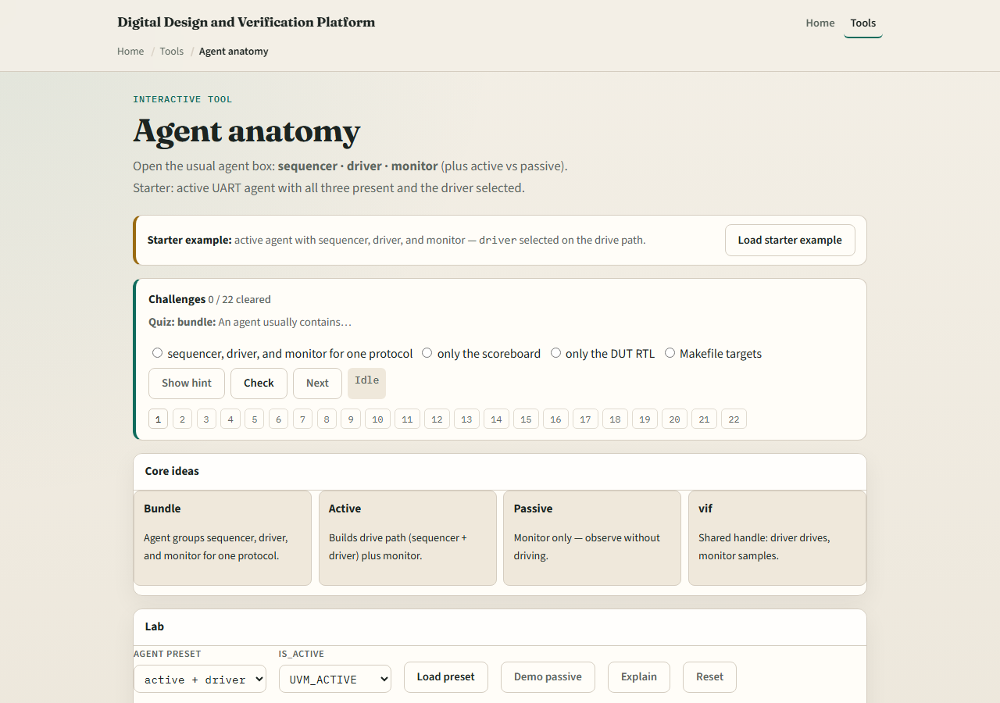
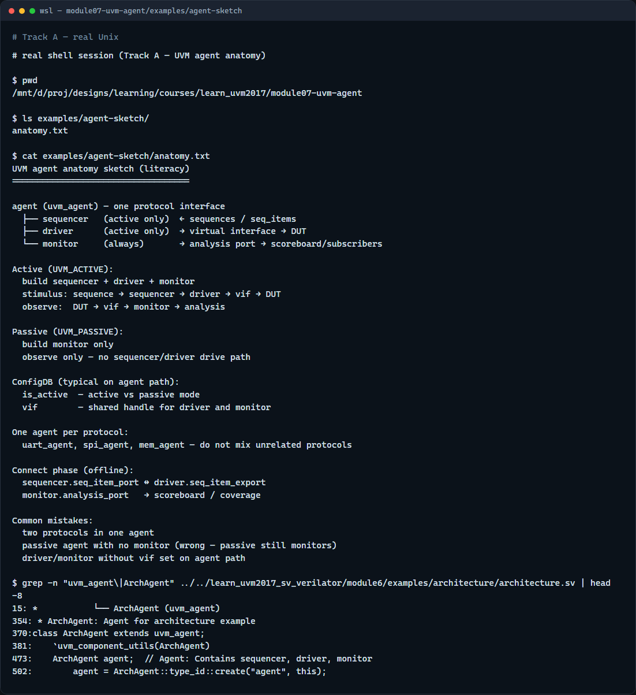

# Module 07 — Agent anatomy

**Module id:** module07-uvm-agent  
**Lab:** uvm-agent  
**Tracks:** A · B

## Slide 1 — Agent anatomy

An agent is the reusable protocol unit in UVM—it groups the pieces that talk to one interface. Sequencer, driver, and monitor live inside the agent boundary, and active versus passive mode decides whether you drive or only observe. This module names those parts and the data paths between them. We will use the browser lab for the diagram, then anchor the same picture in notes you can read offline.

## Slide 2 — Sequencer, driver, monitor, active vs passive

The sequencer is where sequences meet hardware—it hands sequence items to the driver. The driver is the active path: it pulls items and wiggles pins through the virtual interface. The monitor is the observe path: it samples the same interface and publishes transactions on an analysis port. An active agent builds sequencer plus driver plus monitor—you can stimulate and watch. A passive agent keeps the monitor only—useful on a bus you do not own but still need to see. ConfigDB often sets is_active and the virtual interface on the agent path. One agent usually means one protocol interface—UART agent, SPI agent, and so on.

## Slide 3 — Browser lab

In the browser lab track, open the agent anatomy lab. You will see the agent box, three inner blocks, and an active versus passive toggle. Load the starter preset—active agent with the driver highlighted on the drive path. Click sequencer and monitor to read what each does. Switch to passive and notice the drive path disappears while monitor remains. Work a few challenges, then Check. The lab teaches the bundle—not a full UVM compile.

## Slide 4 — Real UVM literacy

In the real UVM track, open this module’s examples folder and read the anatomy sketch—it lists active versus passive build rules in plain language. Trace how a sequence item would flow from sequencer to driver to interface in an active agent, and how the monitor still publishes in parallel. If the in-course hello is checked out, grep for uvm agent in any example—you will see the same trio in SystemVerilog class declarations. You are connecting the layer map from earlier modules to concrete agent innards.

## Slide 5 — Pitfalls to watch

Do not put two unrelated protocols in one agent—split agents instead. Do not assume passive means no monitor—it means no driver path. Do not forget the virtual interface on the agent path before build ends—driver and monitor both need it. And remember: the browser sketch is literacy; offline connect phase still wires TLM ports between sequencer and driver.

## Slide 6 — Your turn

Complete the checklist for at least one track—preferably both. In the browser, toggle active versus passive and explain what disappears. On real UVM, sketch one active agent with labeled sequencer, driver, and monitor. When you are ready, take the short quiz, then continue to TLM ports in the next module.
