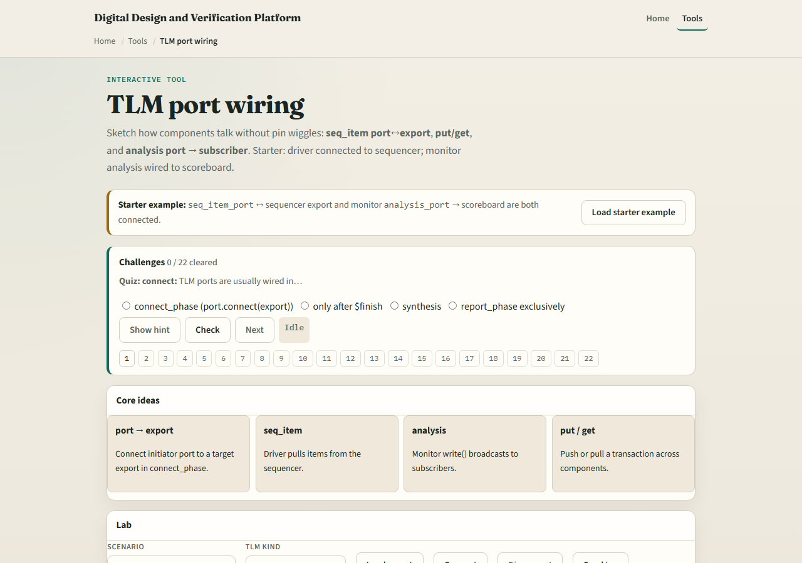
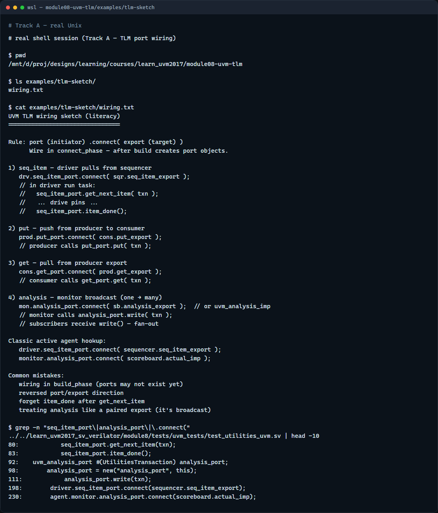

# Module 08 — TLM ports

**Module id:** module08-uvm-tlm  
**Lab:** uvm-tlm  
**Tracks:** A · B

## Slide 1 — TLM ports

UVM components talk through TLM ports and exports—not by reaching into each other’s pins. Connect phase is where you wire them: port on the initiator side, export on the target side, then connect. This module covers the three patterns you will see everywhere—seq item for driver and sequencer, put and get for push or pull, and analysis for monitor broadcast. We will sketch them in the browser lab, then read the same wiring in offline notes.

## Slide 2 — Port, export, and the three patterns

Think port connects to export—the port side initiates, the export side implements the call. Seq item is the classic pull path: the driver’s seq item port connects to the sequencer’s seq item export, then get next item and item done move transactions. Put and get are push or pull styles between producer and consumer blocks. Analysis is different—it is a broadcast: the monitor’s analysis port write fans out to scoreboard imports and other subscribers. You wire all of this in connect phase, after build has created the port objects.

## Slide 3 — Browser lab

In the browser lab track, open the TLM port wiring lab. The starter loads both classic links—driver to sequencer on seq item, and monitor analysis to scoreboard. Try Connect and Disconnect to see when sends fail. Switch kind to analysis and hit Demo analysis to watch a write broadcast. Load the put preset to see push-style wiring. Work a few challenges, then Check. The lab is literacy—you still type connect calls in real UVM.

## Slide 4 — Real UVM literacy

In the real UVM track, open this module’s wiring sketch—it lists connect calls in plain language for each pattern. Trace seq item on the stimulus path and analysis on the observe path in one agent hookup. If the legacy offline course is checked out, grep for seq item port connect in module eight examples—you will see driver dot seq item port dot connect to sequencer dot seq item export, and monitor analysis port to scoreboard import. Same picture, real SystemVerilog.

## Slide 5 — Pitfalls to watch

Do not wire ports in build—they may not exist yet; connect phase is the usual place. Do not confuse port and export direction—initiator connects to target. Do not forget item done after get next item or the sequencer stalls. Analysis write is one-to-many, not a paired export like seq item. And remember: the browser lab shows the topology; your testbench still needs the actual connect statements in connect phase.

## Slide 6 — Your turn

Complete the checklist for at least one track—preferably both. In the browser, load starter, disconnect analysis, and explain what breaks. On real UVM, sketch seq item and analysis links for one active agent. When you are ready, take the short quiz, then continue to sequence flow in the next module.
