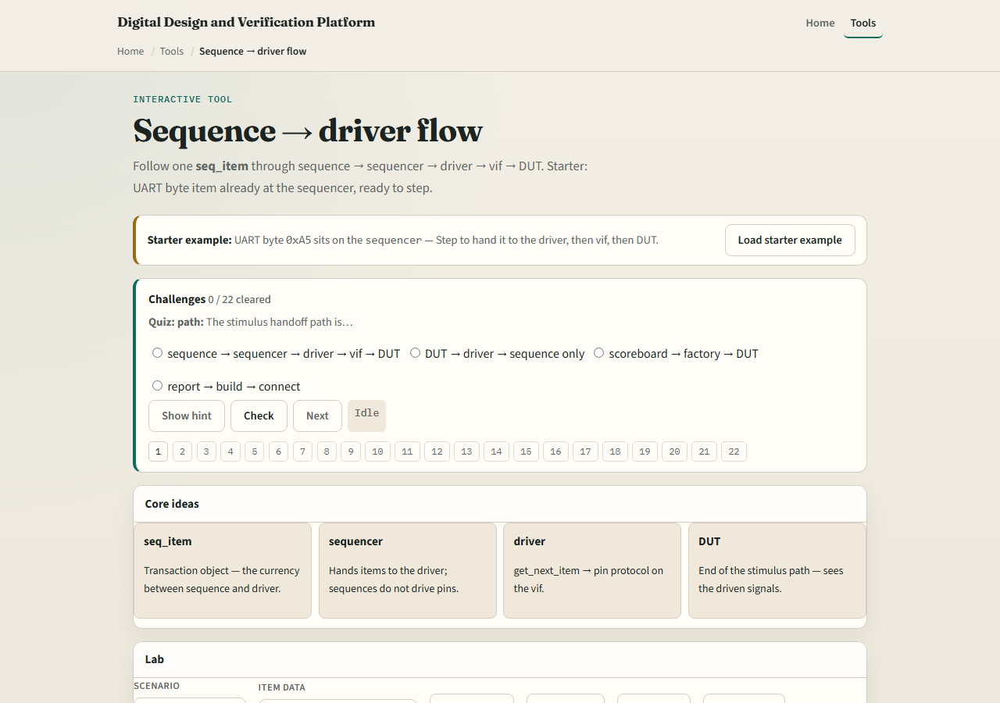
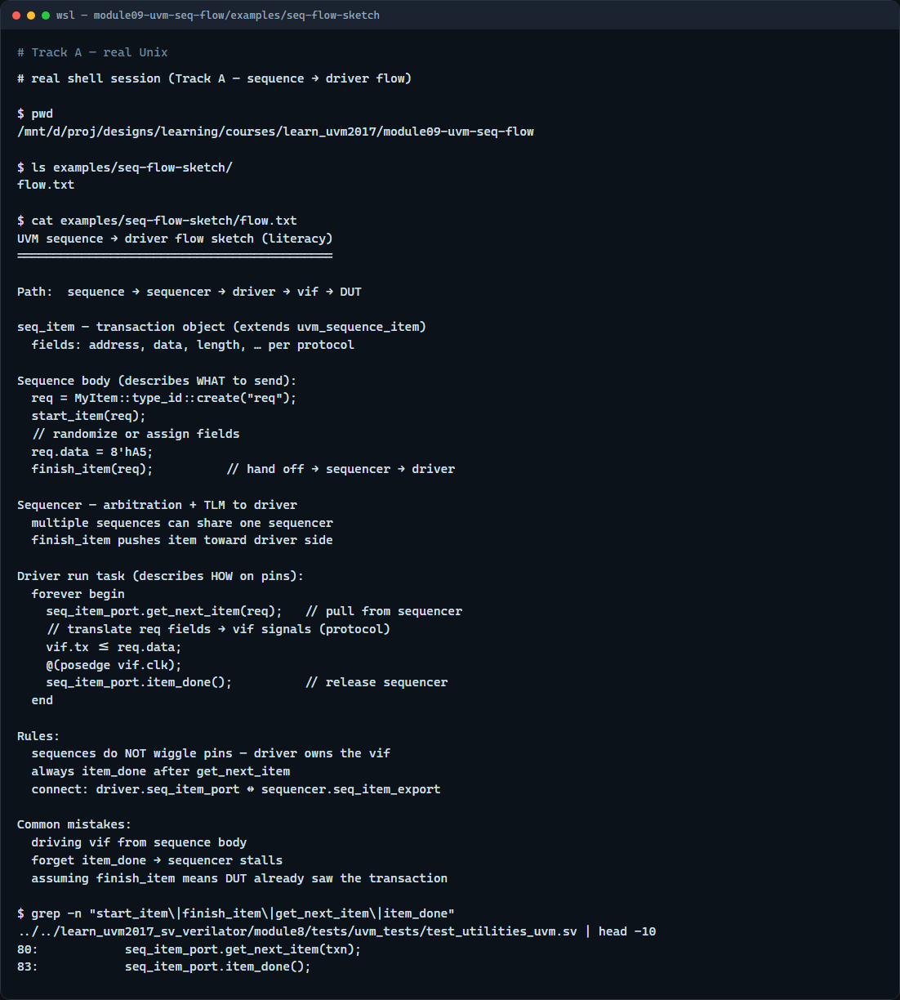

# Sequence to driver

A sequence describes what to send, it builds sequence items and hands them to a sequencer

---

## Items, start and finish, get and done
- The seq item is the transaction object, the currency between sequence and driver
- In the sequence body you create an item
- The driver does not push
- Sequences never wiggle pins directly, that is the driver’s job
- Multiple sequences can share one sequencer; arbitration decides who goes next

---

## Browser lab

---

## Real UVM literacy

---

## Pitfalls to watch
- Do not drive pins from the sequence, that bypasses the driver and breaks reuse
- Do not forget item done after get next item or the sequencer stalls waiting for you
- Do not assume finish item means the DUT saw it yet, the driver still has to run
- And remember

---

## Your turn
- Complete the checklist for at least one track, preferably both
- In the browser, step from sequencer to DUT and name each stage
- On real UVM, sketch the five-stage path with one example transaction
- When you are ready, take the short quiz, then continue to objections in the next module

