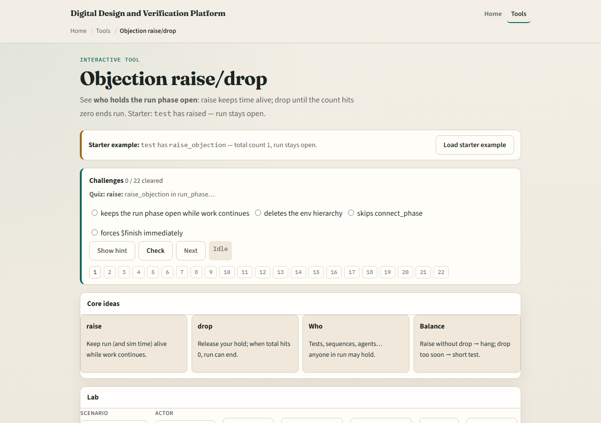
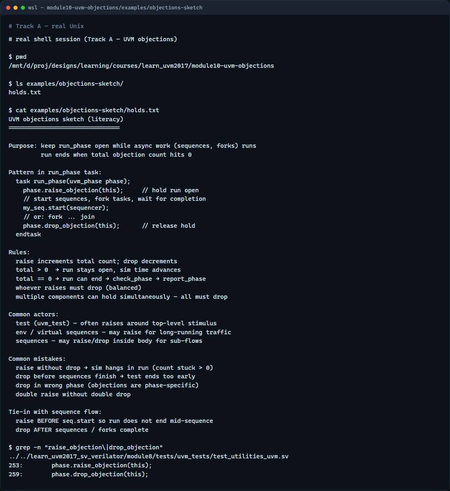

# Objections

Run phase is where your test actually runs, but UVM needs to know when work is still in flight

---

## Raise, drop, and the total count
- In run phase you call raise objection on the phase object
- When your task finishes, call drop objection to release your hold
- Multiple components can raise at once, test, sequence, env
- Forget to drop and run hangs with objections stuck above zero
- Drop too early and your test ends before sequences or drivers finish
- The rule is simple: whoever raises should drop

---

## Browser lab

---

## Real UVM literacy

---

## Pitfalls to watch
- Do not raise in build and forget run phase, that is the wrong phase for time advancement
- Do not drop before your sequences finish or run ends too soon
- Do not assume one component’s drop clears everyone, each holder must drop
- Double raises need double drops
- And remember

---

## Your turn
- Complete the checklist for at least one track, preferably both
- In the browser, load multi and explain why one drop is not enough
- On real UVM, sketch a run phase task with raise, sequence start, and drop
- When you are ready, take the short quiz, then continue to plusargs in the next module

