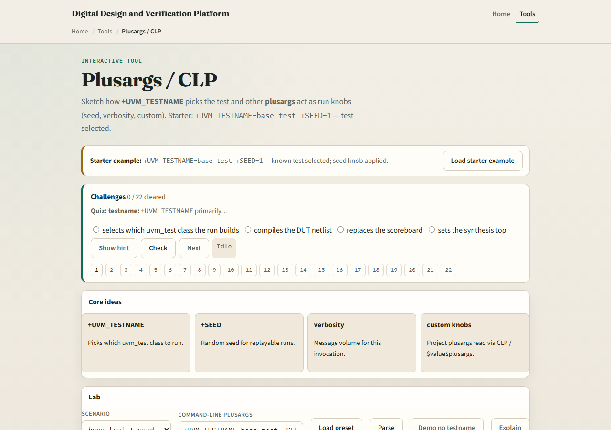
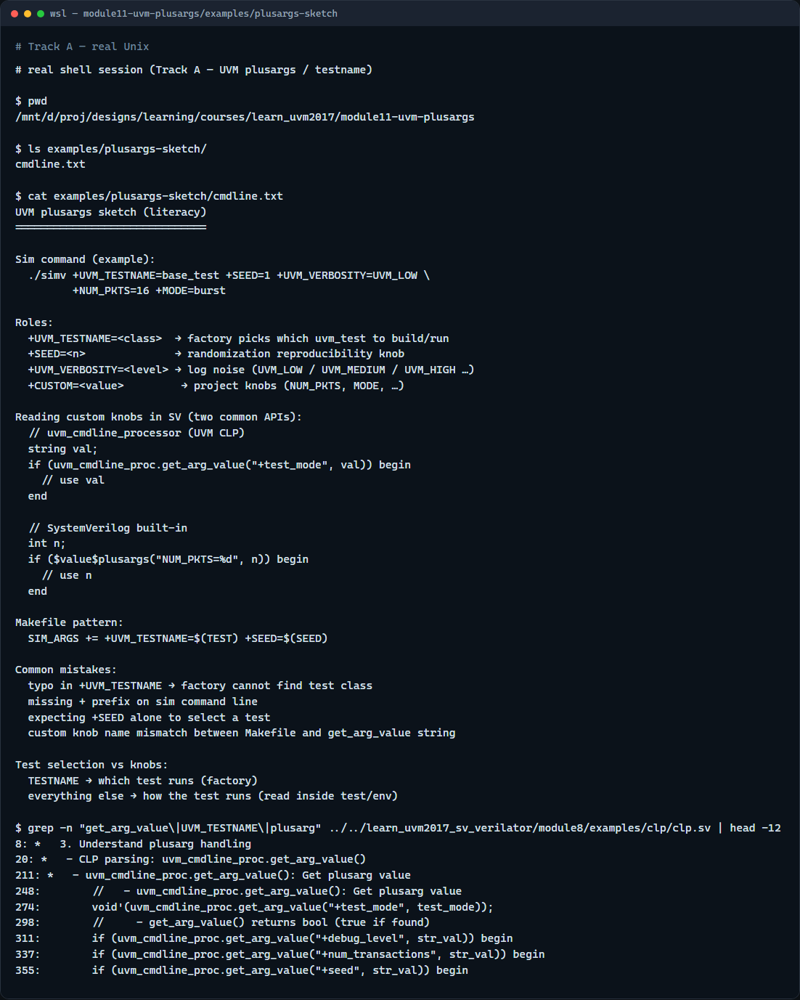

# Module 11 — Plusargs / testname

**Module id:** module11-uvm-plusargs  
**Lab:** uvm-plusargs  
**Tracks:** A · B

## Slide 1 — Plusargs and testname

Simulation command lines carry more than the binary—they pass plusargs that configure the run. Plus UVM testname picks which uvm test class the factory builds at run time. Other plusargs like seed, verbosity, and custom knobs tune behavior without recompiling. This module separates test selection from project knobs. We will parse a command line in the browser lab, then read the same ideas in offline notes.

## Slide 2 — UVM testname versus custom knobs

Plus UVM testname is the standard switch for test selection—the run time factory instantiates that test class. If it is missing, you have no selected test from that plusarg. Seed and verbosity are common UVM knobs—seed for reproducibility, verbosity for log noise. Custom plusargs like plus num pkts or plus mode are project-specific—you read them with uvm cmdline processor get arg value or dollar value plusargs in SystemVerilog. Unknown testname means the factory cannot find the class—that is a different failure from a missing custom knob.

## Slide 3 — Browser lab

In the browser lab track, open the plusargs lab. The starter loads plus UVM testname equals base test and plus seed equals one—test selected OK. Hit Parse and read the breakdown: testname, seed, and any custom keys. Try the smoke preset with high verbosity, then the no testname demo to see selection fail. Load the unknown test preset to see a bad class name. Work a few challenges, then Check. The lab is literacy; real sims pass the same strings on the command line or in your Makefile.

## Slide 4 — Real UVM literacy

In the real UVM track, open this module’s plusargs sketch—it shows a sample sim command and how to read knobs in plain language. Trace which args select the test versus which ones your test reads in build or run. If the in-course hello is checked out, grep for get arg value in the cmdline processor example—you will see plus test mode and plus seed parsed in SystemVerilog. Makefile plusargs and simulator args must agree on the plus prefix syntax.

## Slide 5 — Pitfalls to watch

Do not confuse plus UVM testname with a random custom string—it is the factory hook for uvm test. Do not forget the plus prefix on the sim command line. Do not assume seed alone selects a test—you still need testname unless your flow defaults it elsewhere. Typos in testname fail at factory time, not as a missing plusarg. And remember: the browser parser is a sketch; your project still registers test classes with the factory.

## Slide 6 — Your turn

Complete the checklist for at least one track—preferably both. In the browser, parse starter then demo no testname and explain the difference. On real UVM, write one command line with testname, seed, and a custom knob. When you are ready, take the short quiz, then continue to constrained random lite in the next module.
