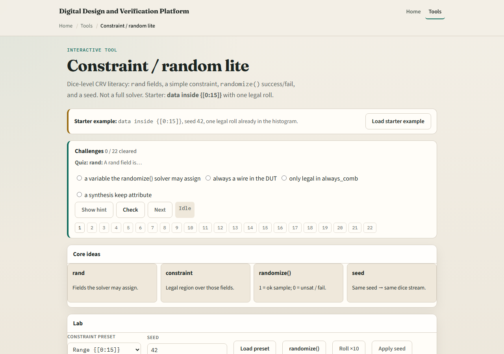
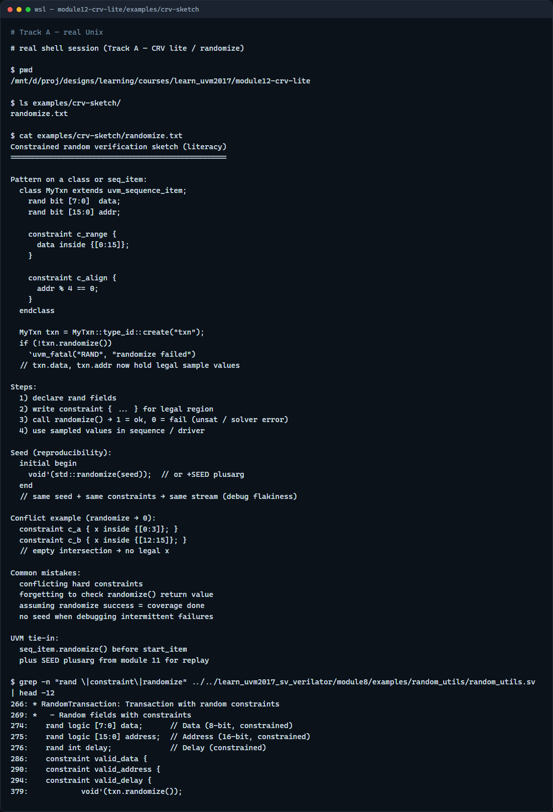

# CRV lite

Constrained random verification means you declare what can vary

---

## Rand, constraints, and randomize
- Mark fields with rand so the solver may assign them
- A constraint block carves the legal region
- Randomize returns one if a legal sample was found
- Seed controls reproducibility, same seed, same stream when you replay
- Conflict presets show overlapping hard constraints with an empty intersection
- Real CRV uses a full solver

---

## Browser lab

---

## Real UVM literacy

---

## Pitfalls to watch
- Do not treat randomize success as coverage done, you still need checks and covergroups
- Do not write conflicting hard constraints and expect the solver to pick a side
- Do not forget seed when debugging a flaky failure, you need replay
- Soft constraints exist in full SV but this lab focuses on hard constraints first
- And remember: the browser histogram is discrete; real solvers search huge spaces

---

## Your turn
- Complete the checklist for at least one track, preferably both
- In the browser, load conflict and explain why randomize returns zero
- On real UVM, sketch one rand transaction with two constraints
- When you are ready, take the short quiz, then continue to scoreboards in the next module

