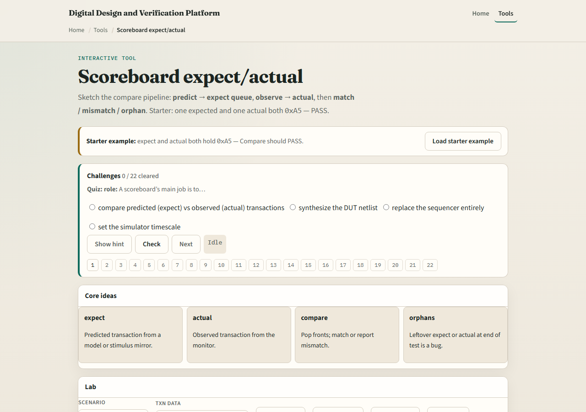
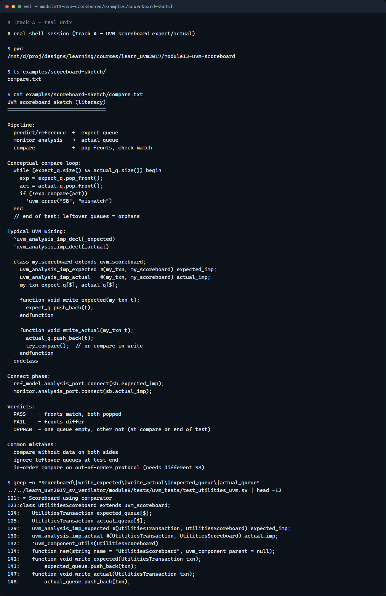

# Module 13 — Scoreboard

**Module id:** module13-uvm-scoreboard  
**Lab:** uvm-scoreboard  
**Tracks:** A · B

## Slide 1 — Scoreboard

A scoreboard checks that what you predicted matches what the DUT actually did. Predicted transactions land in an expect queue; observed transactions from the monitor land in actual. Compare pops the fronts and checks for a match—or reports a mismatch. This module is the expect versus actual pipeline in miniature. We will push and compare in the browser lab, then read the same queues in offline notes.

## Slide 2 — Predict, observe, compare

The predict path builds what should happen—a reference model or checker pushes into expect. The observe path is the monitor analysis port—real bus activity becomes actual. Compare is the heartbeat: pop one from each queue, check equality, repeat. A pass means the values matched; a fail means expect and actual differed. Orphans are leftovers—expect with no actual means you predicted something never observed; actual with no expect means you saw traffic you never predicted. Both are usually bugs at end of test.

## Slide 3 — Browser lab

In the browser lab track, open the scoreboard expect actual lab. The starter loads expect and actual both holding hex A five—click Compare for pass. Load mismatch to see A five versus five A fail. Try orphan expect and orphan actual presets to see one-sided leftovers. Push expect and push actual manually from empty, then compare step by step. Work a few challenges, then Check. The lab is literacy; real UVM uses analysis imports and write methods on the scoreboard class.

## Slide 4 — Real UVM literacy

In the real UVM track, open this module’s scoreboard sketch—it lists expect and actual queues and compare in plain language. Trace how monitor analysis connects to actual import and how a reference model feeds expect. If the legacy offline course is checked out, grep for uvm scoreboard in a module eight test—you will see write expected and write actual functions with queue pop loops. TLM analysis from module eight is what fills these queues.

## Slide 5 — Pitfalls to watch

Do not compare without both queues having data—or you get orphan reports instead of a clean match. Do not ignore leftover queues at test end—orphans mean missing stimulus or missing checks. Do not assume in-order compare works for every protocol—some designs need out-of-order scoreboards. And remember: the browser lab compares hex strings; real scoreboards compare full transaction objects field by field.

## Slide 6 — Your turn

Complete the checklist for at least one track—preferably both. In the browser, run starter compare pass then demo mismatch and name the verdict. On real UVM, sketch predict and observe paths into one scoreboard. When you are ready, take the short quiz, then continue to RAL map in the next module.
