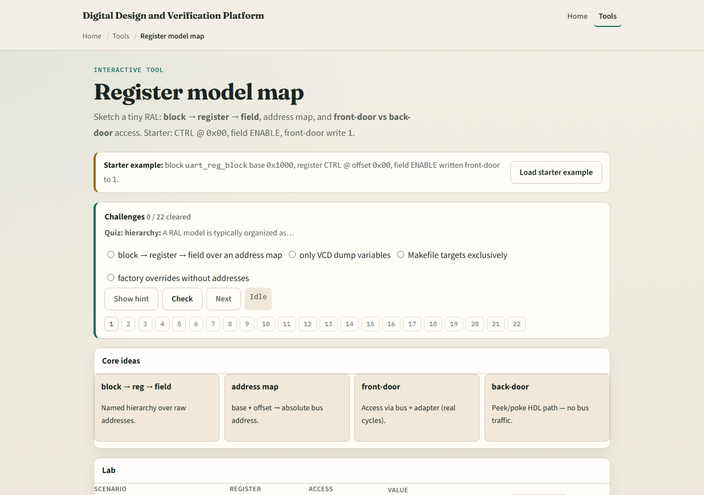
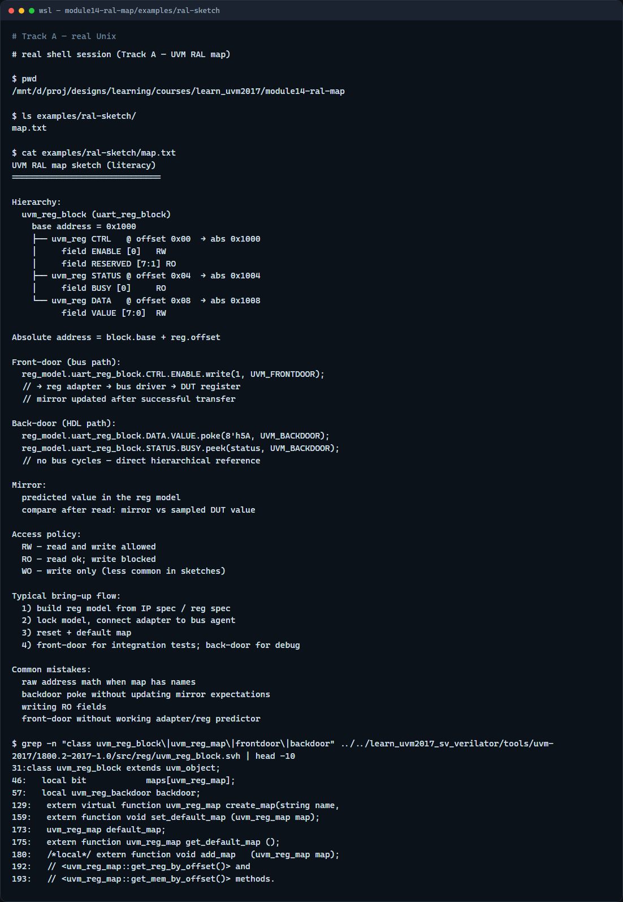

# Module 14 — RAL map

**Module id:** module14-ral-map  
**Lab:** ral-map  
**Tracks:** A · B

## Slide 1 — RAL map

Register tests often drown in raw hex addresses—RAL gives them names. A register block owns the base address; registers sit at offsets; fields are named bit slices inside each register. This module is map literacy—block, register, field, and how absolute addresses are computed. We will write a field in the browser lab, then read the same hierarchy in offline notes.

## Slide 2 — Block, register, field, and access paths

Think block contains registers, register contains fields—you test at field granularity, not random bit masks. Absolute address equals block base plus register offset. Front-door access goes through the bus—adapter and driver, real cycles, good for integration. Back-door peek and poke uses an HDL path—no bus traffic, fast for debug and bring-up. The mirror holds the model’s predicted value; compare mirror to DUT after reads. Read-only fields block writes—that is access policy in the map.

## Slide 3 — Browser lab

In the browser lab track, open the register model map lab. The starter loads uart reg block with CTRL at offset zero—front-door write ENABLE to one. Explore the tree: block, register, field. Try STATUS read-only and watch write blocked. Load DATA backdoor poke to see peek without bus cycles. Reset the map and pick another register. Work a few challenges, then Check. The lab is literacy; real UVM builds uvm reg classes from your IP spec.

## Slide 4 — Real UVM literacy

In the real UVM track, open this module’s RAL sketch—it lists block base, offsets, and front versus back door in plain language. Trace one write from reg model call through adapter to bus, versus a backdoor poke straight to RTL. If the in-course hello is checked out, peek at uvm reg model headers in the UVM tree—you will see block, reg, and field class patterns. RAL connects register sequences to the same agent and bus you already know.

## Slide 5 — Pitfalls to watch

Do not hand-compute addresses when the map already defines them—use named registers. Do not poke backdoor and forget to update the mirror—or predict and DUT drift apart. Do not write read-only fields and expect success. Front-door needs a working adapter; back-door needs a valid HDL path. And remember: the browser lab is a sketch; your block class still needs build and lock model in real UVM.

## Slide 6 — Your turn

Complete the checklist for at least one track—preferably both. In the browser, front-door write CTRL then explain absolute address. On real UVM, sketch block, one register, and one field with base plus offset. When you are ready, take the short quiz, then continue to SVA timeline lite in the next module.
