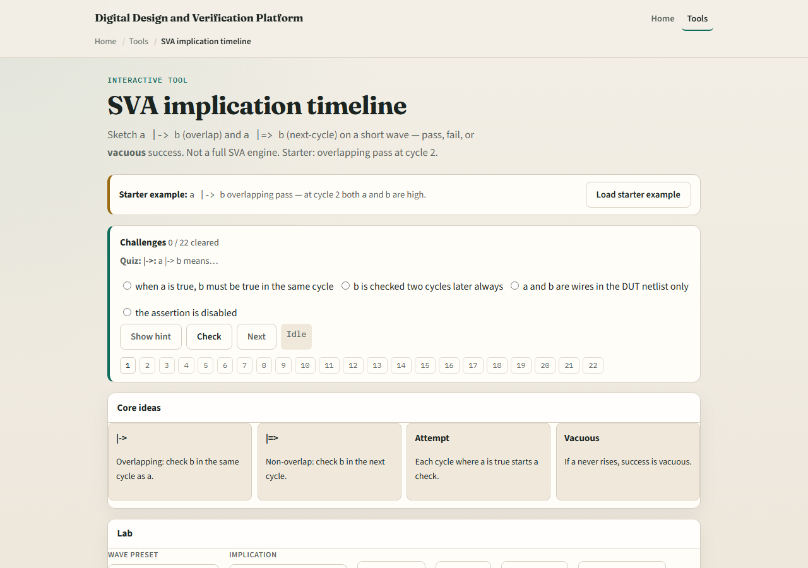
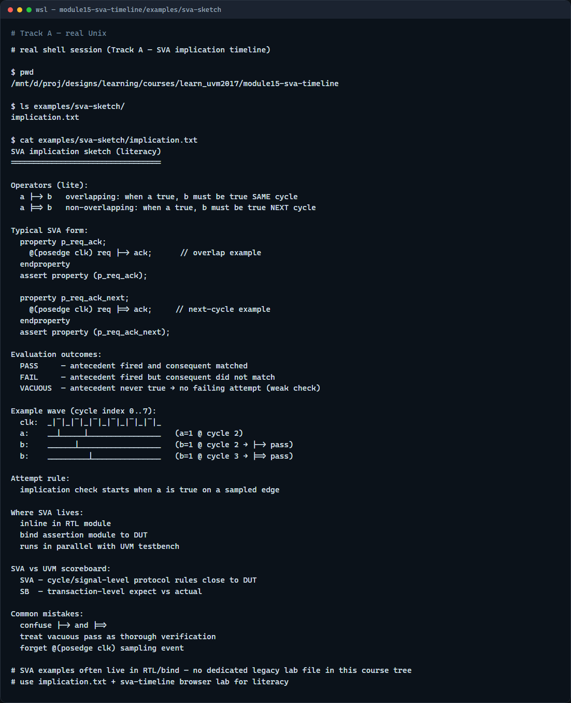

# SVA timeline lite

Assertions check protocol rules on the timeline, not just at end of test

---

## Overlap, next cycle, and vacuous
- Pipe arrow overlap means when a is true, check b in the same cycle
- Double pipe arrow non-overlap means when a is true, check b on the next cycle
- An attempt starts when the antecedent fires, a high on that clock edge
- Pass means the consequent matched; fail means a fired but b did not
- Vacuous success means a never went high
- Real SVA wraps this in a property and assert property on posedge clock

---

## Browser lab

---

## Real UVM literacy

---

## Pitfalls to watch
- Do not confuse overlap and next-cycle operators, they check different cycles
- Do not treat vacuous pass as strong coverage, if a never fires, the rule never exercised
- Do not write assertions without clocking, posedge clk is the usual sampling event
- And remember

---

## Your turn
- Complete the checklist for at least one track, preferably both
- In the browser, load overlap fail and explain the verdict
- On paper, sketch a pipe arrow b pass and a double-pipe b pass on the same wave
- When you are ready

