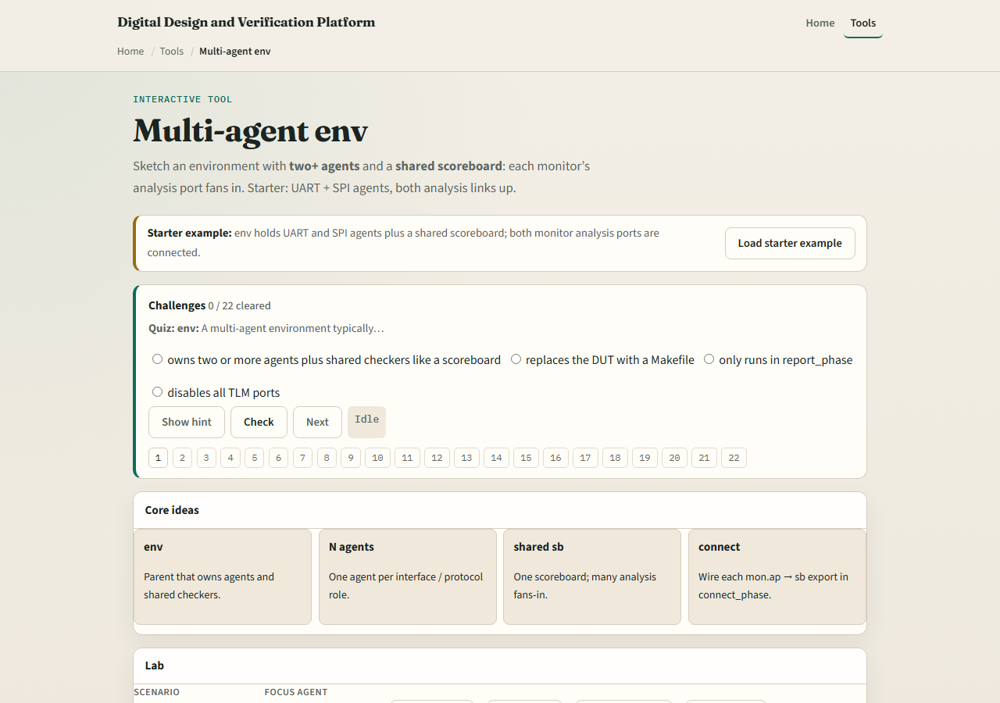
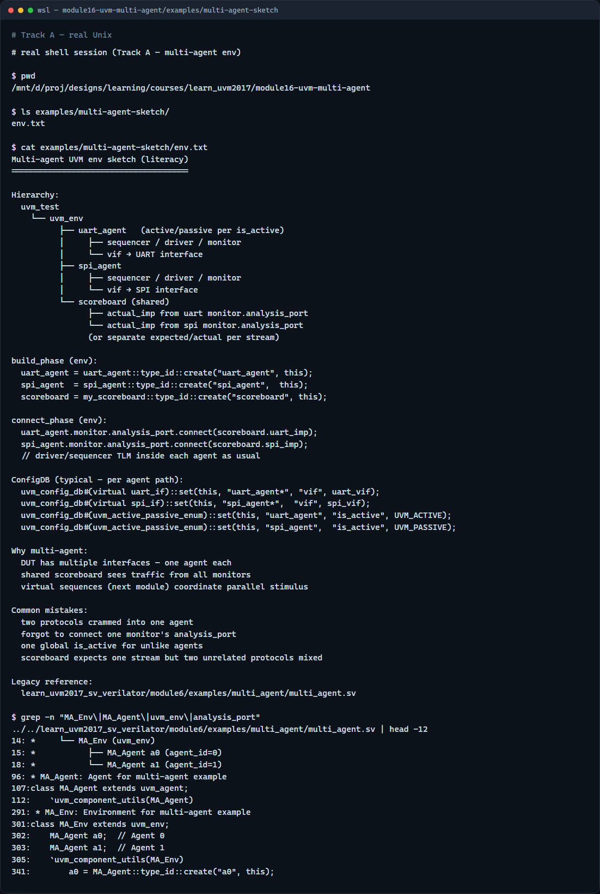

# Module 16 — Multi-agent env

**Module id:** module16-uvm-multi-agent  
**Lab:** uvm-multi-agent  
**Tracks:** A · B

## Slide 1 — Multi-agent env

Real designs rarely have one bus—your testbench env often owns several agents, one per interface or protocol role. A shared scoreboard can fan in analysis from every monitor to check the whole system. This module sketches env with UART plus SPI agents and one scoreboard. We will wire analysis links in the browser lab, then read the same hierarchy in offline notes.

## Slide 2 — Env, N agents, and shared checkers

The environment is the parent that builds agents and shared components like scoreboard or coverage. Each agent still follows the one-protocol rule—UART agent on the UART interface, SPI agent on SPI. Active versus passive is still per agent via is active in ConfigDB. In connect phase, each monitor analysis port connects to the shared scoreboard import—fan-in from many observers to one checker. Stimulus may run in parallel on each agent; checking stays centralized unless you split scoreboards on purpose.

## Slide 3 — Browser lab

In the browser lab track, open the multi-agent env lab. The starter loads UART and SPI agents under env, both analysis ports wired to a shared scoreboard. Click Observe to see a beat from an agent. Try Disconnect on one analysis link and see observe blocked. Load UART-only and Add SPI to grow into multi-agent. Demo fan-in to watch both agents feed the scoreboard. Work a few challenges, then Check. The lab is literacy—you still declare each agent in build and connect in real UVM.

## Slide 4 — Real UVM literacy

In the real UVM track, open this module’s multi-agent sketch—it lists env, two agents, and scoreboard fan-in in plain language. Trace build creating uart agent and spi agent, then connect linking both monitor analysis ports to scoreboard imports. If the legacy offline course is checked out, grep for multi agent in module six—you will see an env with two agents and coordination patterns. Virtual sequences on the next module often start traffic on multiple agents from one test.

## Slide 5 — Pitfalls to watch

Do not put two unrelated protocols in one agent—add a second agent instead. Do not forget to connect every monitor you care about—or that agent’s traffic never reaches the scoreboard. Do not assume one agent’s ConfigDB settings apply to another—set vif and is active per agent path. And remember: multi-agent env is about structure; parallel sequence coordination comes in the virtual sequence module next.

## Slide 6 — Your turn

Complete the checklist for at least one track—preferably both. In the browser, disconnect one analysis link and explain what breaks. On real UVM, sketch env with two agents and one shared scoreboard. When you are ready, take the short quiz, then continue to virtual sequences in the next module.
