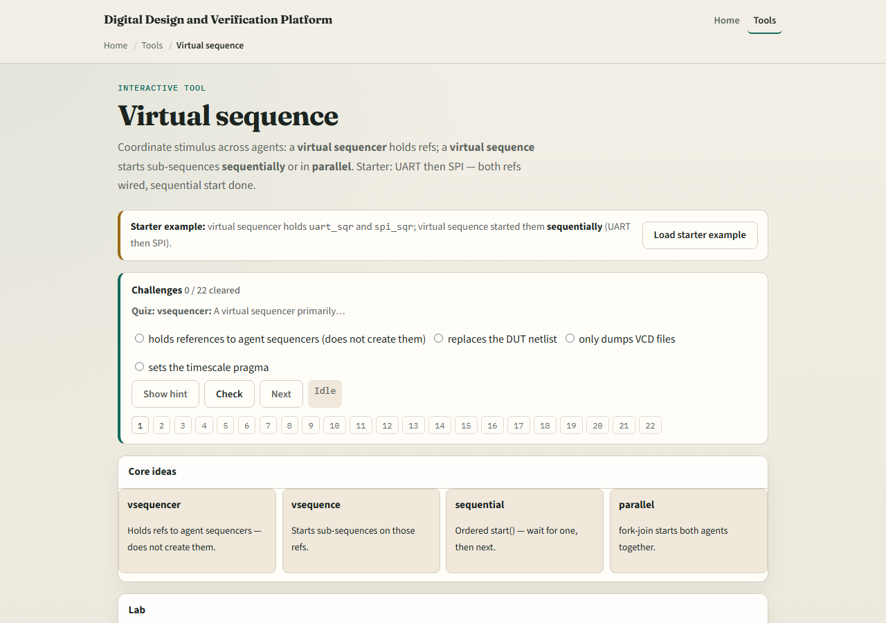
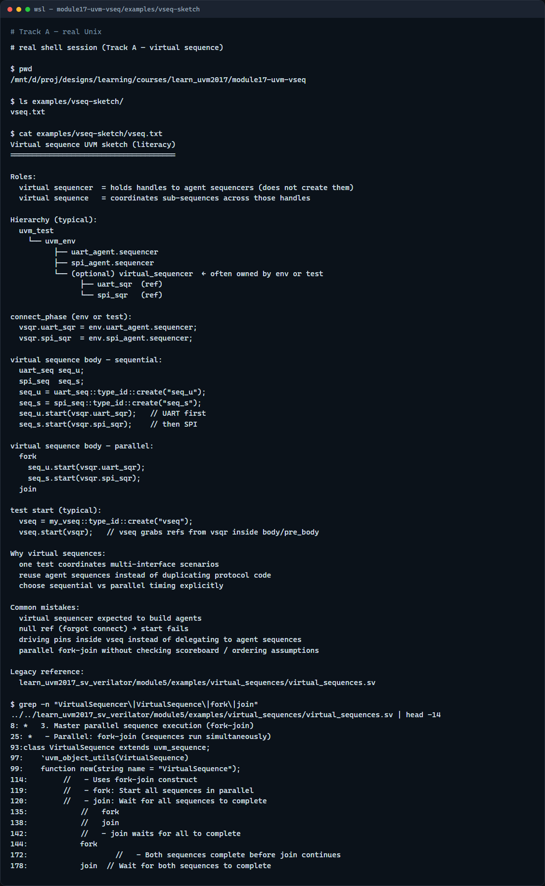

# Virtual sequence

Multi-agent env gives you several sequencers, one per active agent

---

## Virtual sequencer vs virtual sequence
- The virtual sequencer is a container
- In connect phase the env wires those refs from each agent’s sequencer
- Calls start on sub-sequences
- Sequential mode runs UART first, then SPI
- Parallel mode uses fork-join so both start at once
- Missing or null refs fail at start time

---

## Browser lab

---

## Real UVM literacy

---

## Pitfalls to watch
- Do not expect the virtual sequencer to build agents
- Do not start a sub-sequence on a null ref, check wiring before start
- Do not assume sequential and parallel behave the same
- Keep pin wiggling in drivers
- And remember

---

## Your turn
- Complete the checklist for at least one track, preferably both
- In the browser
- Sketch virtual sequencer refs and one virtual sequence body with two start calls
- When you are ready, take the short quiz, then continue to callbacks in the next module

