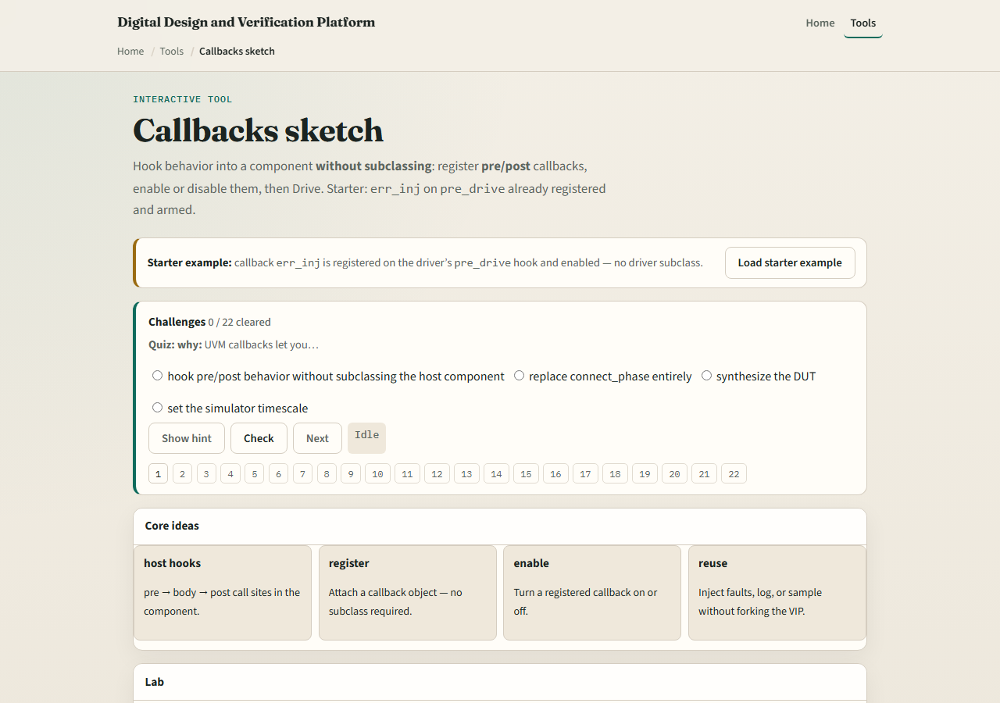
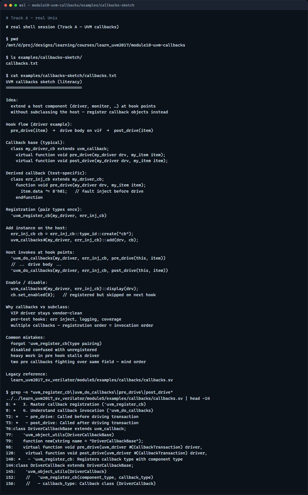

# Module 18 — Callbacks

**Module id:** module18-uvm-callbacks  
**Lab:** uvm-callbacks  
**Tracks:** A · B

## Slide 1 — Callbacks

You often need to tweak VIP behavior for one test—inject a fault, add logging, sample coverage—without subclassing the vendor driver. UVM callbacks register hook objects on a host component and run at named points like pre drive and post drive. The host runs pre hooks, then its body, then post hooks. You can enable or disable each callback individually. This module sketches that pattern on a driver with error inject on pre drive. We will register and drive in the browser lab, then read the same hooks in offline notes.

## Slide 2 — Register, enable, and hook order

The callback base class defines virtual pre and post methods. Your test registers a derived callback on the host with uvm callbacks add—no driver subclass required. The host invokes registered callbacks in registration order at each hook point. Pre hooks can modify the transaction before drive; post hooks observe after the body runs. Disable a callback and the host skips it even if still registered. Typical uses: fault injection, protocol logging, cover sampling, and test-specific quirks—each as a separate callback object you can turn on or off.

## Slide 3 — Browser lab

In the browser lab track, open the callbacks sketch lab. The starter registers err inj on the driver pre drive hook and leaves it enabled—no driver subclass. Click Drive and watch pre flip a bit on the item, then the host body runs. Try the both preset with err inj plus a post logger. Load disabled and see drive skip the callback even though it is registered. Register from empty and build up hooks one at a time. Work a few challenges, then Check. The lab is literacy—you still declare callback classes and uvm do callbacks in real UVM.

## Slide 4 — Real UVM literacy

In the real UVM track, open this module’s callbacks sketch—it lists callback base, registration, and pre body post flow in plain language. Trace uvm register cb pairing the driver type with your callback type, then uvm do callbacks at pre drive and post drive inside the driver run task. If the legacy offline course is checked out, grep for uvm register cb or pre drive in module five callbacks—you will see fault inject and logging without forking the driver source. Callbacks complement factory overrides: hooks extend behavior at runtime per test.

## Slide 5 — Pitfalls to watch

Do not subclass a VIP driver for every test tweak—callbacks keep the base driver stable. Do not forget to register the callback type with the host type or uvm do callbacks will not find it. Do not assume disabled means unregistered—disabled callbacks are skipped but still on the list. Do not put time-consuming work in pre hooks if it stalls the driver—keep hooks focused. And remember: multiple callbacks run in registration order; order matters when two hooks touch the same field.

## Slide 6 — Your turn

Complete the checklist for at least one track—preferably both. In the browser, drive with err inj enabled, then disable it and explain what changes on the item. On real UVM, sketch one pre hook and one post hook on a driver. When you are ready, take the short quiz, then continue to reporting in the next module.
