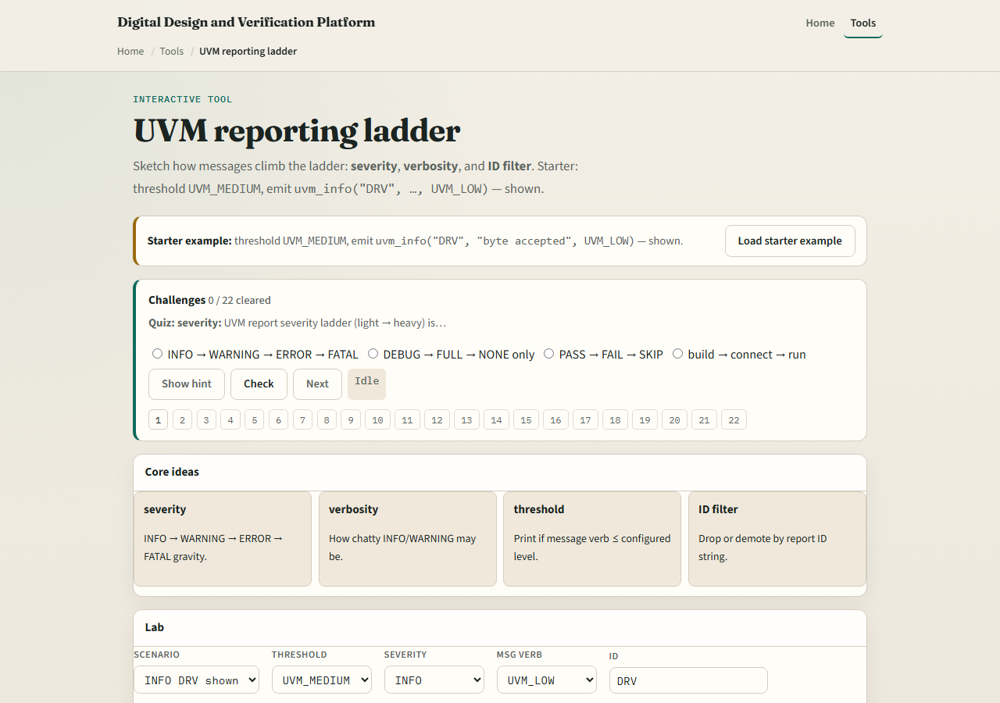
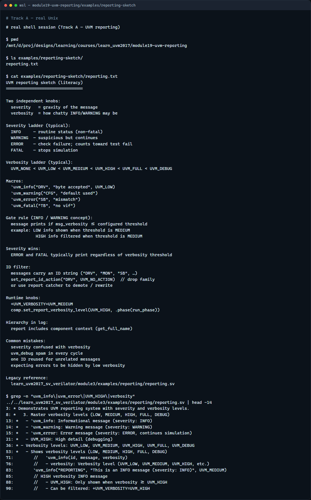

# Module 19 — Reporting

**Module id:** module19-uvm-reporting  
**Lab:** uvm-reporting  
**Tracks:** A · B

## Slide 1 — UVM reporting

Simulation logs get noisy fast—UVM reporting gives you two independent knobs. Severity is gravity: info, warning, error, fatal. Verbosity is how chatty info and warning may be—low, medium, high, full, debug. An info message prints only if its verbosity is at or below your configured threshold. Errors and fatals still print even when verbosity is turned down. You can also filter by message ID to drop a whole family of messages. This module walks that ladder in the browser lab, then reads the same macros in offline notes.

## Slide 2 — Severity, verbosity, and ID filter

Use uvm info with an ID string, message text, and verbosity level—the ID helps you filter later. uvm warning, uvm error, and uvm fatal set severity; error and fatal typically always reach the log regardless of verbosity gate. The component or global threshold decides which info messages survive—a message at low verbosity shows when threshold is medium; high verbosity info is filtered out at medium. set report id action and plusargs like UVM verbosity let you tune per run. ID filters drop or demote matching IDs before print—handy to silence a chatty driver without touching its source.

## Slide 3 — Browser lab

In the browser lab track, open the UVM reporting ladder lab. The starter emits an info from ID DRV at low verbosity with threshold medium—the message is shown. Click Emit again and read the trace line. Try the filtered preset where message verbosity high exceeds threshold medium and watch it disappear. Load the error preset—even with threshold none, the error still prints. Try the ID filter preset to block DRV entirely. Work a few challenges, then Check. The lab is literacy—you still call uvm info and set report verbosity in real UVM.

## Slide 4 — Real UVM literacy

In the real UVM track, open this module’s reporting sketch—it lists severity ladder, verbosity gate, and ID filter rules in plain language. Trace uvm info with ID and verbosity, then compare uvm error which ignores the verbosity gate. If the legacy offline course is checked out, grep for uvm info or UVM HIGH in module three reporting—you will see the same macros with hierarchical context in the log. Reporting complements scoreboard mismatches: errors flag check failures; verbosity keeps routine info under control.

## Slide 5 — Pitfalls to watch

Do not confuse severity with verbosity—severity is how serious; verbosity is how loud info may be. Do not expect uvm error to respect a low verbosity threshold—it should still print. Do not flood sim with uvm debug on every cycle—raise threshold for regression runs. Do not reuse one ID for unrelated messages—you lose filter precision. And remember: fatals stop the run; errors increment the error count and may fail the test at end unless you demote or catch them.

## Slide 6 — Your turn

Complete the checklist for at least one track—preferably both. In the browser, show one info that passes the gate and one that is filtered, then emit an error and confirm it always prints. On real UVM, sketch one uvm info line with ID and verbosity plus one uvm error. When you are ready, take the short quiz, then continue to the protocol checker module next.
