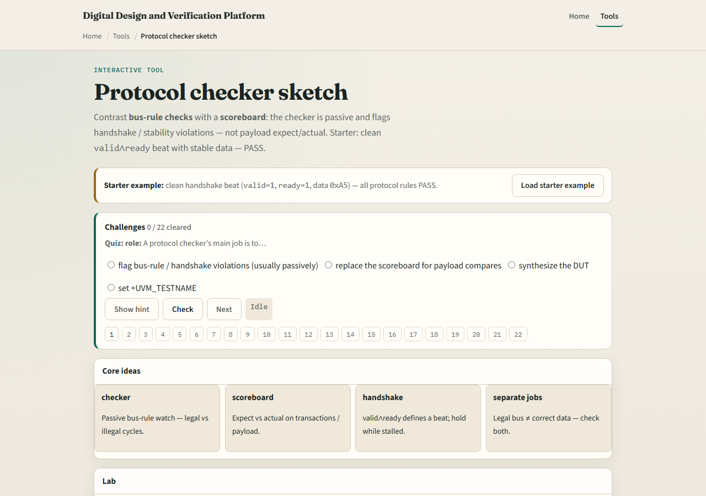
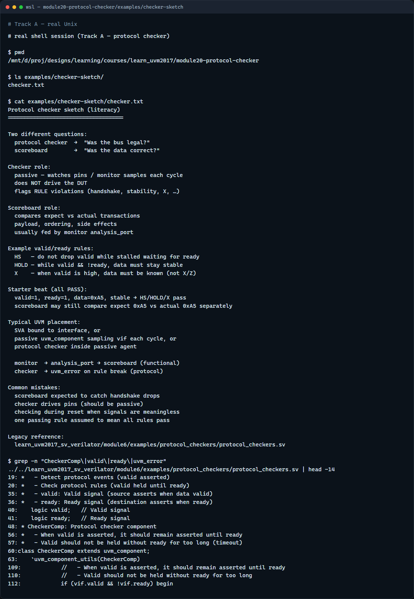

# Module 20 — Protocol checker

**Module id:** module20-protocol-checker  
**Lab:** protocol-checker  
**Tracks:** A · B

## Slide 1 — Protocol checker

A scoreboard asks whether the data was correct—expect versus actual. A protocol checker asks whether the bus was legal while that data moved. Handshake drops, unstable data while stalled, unknown values when valid—these are rule violations even if the payload happens to match. The checker is passive: it watches pins or monitor samples each cycle and flags broken rules. It does not drive the DUT and it does not replace functional checking. This module sketches valid-ready rules in the browser lab, then reads the same split in offline notes.

## Slide 2 — Checker vs scoreboard

The scoreboard compares transactions—did we get the byte we expected, in the right order? The protocol checker enforces bus rules—was valid held until ready, was data stable while valid and not ready, was data known when valid was high? A legal beat can still carry wrong data; correct data on an illegal beat is still a bug. In UVM you often bind SVA or a passive checker component alongside the monitor. Monitor feeds the scoreboard; checker or assertions guard the wire protocol. Keep the two roles separate in your head and in your testbench hierarchy.

## Slide 3 — Browser lab

In the browser lab track, open the protocol checker sketch lab. The starter shows valid and ready both high with stable data A5—all three rules pass. Click Check rules and read HS handshake, HOLD data hold, and X no unknown when valid. Try drop valid before ready and watch the handshake rule fail. Load data changes while stalled and see HOLD fail. Try X while valid for the unknown-data rule. The scoreboard panel compares expect versus actual separately—legal bus and correct payload are different jobs. Work a few challenges, then Check.

## Slide 4 — Real UVM literacy

In the real UVM track, open this module’s protocol checker sketch—it lists handshake, data hold, and no-X rules plus checker versus scoreboard roles in plain language. Trace a passive checker sampling valid and ready each cycle without driving. If the in-course hello is checked out, grep for CheckerComp or valid held in module six protocol checkers—you will see handshake monitoring with uvm error on violation. SVA on the interface is the same idea in declarative form; the monitor still feeds the scoreboard for payload checks.

## Slide 5 — Pitfalls to watch

Do not expect the scoreboard to catch dropped valid—that is a protocol checker or assertion job. Do not drive pins from the checker—it should be passive. Do not disable checking during reset without meaning to—rules apply once reset releases. Do not conflate one passing rule with all rules passing—check each handshake, hold, and X rule. And remember: a clean protocol beat does not prove functional correctness; you still need expect versus actual somewhere.

## Slide 6 — Your turn

Complete the checklist for at least one track—preferably both. In the browser, pass the starter beat, then break one rule and name which checker fired. On real UVM, sketch three valid-ready rules and one scoreboard comparison. When you are ready, take the short quiz, then continue to VIP anatomy in the next module.
