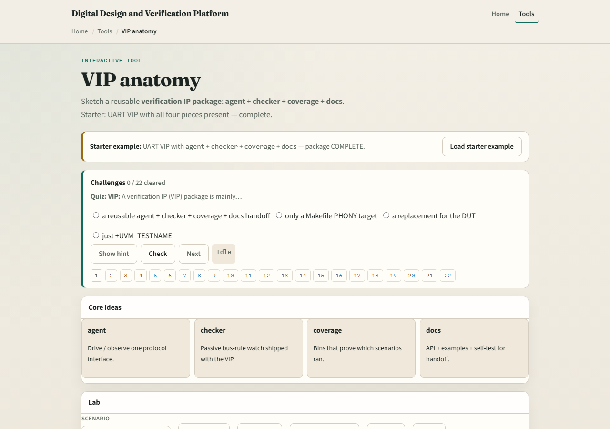
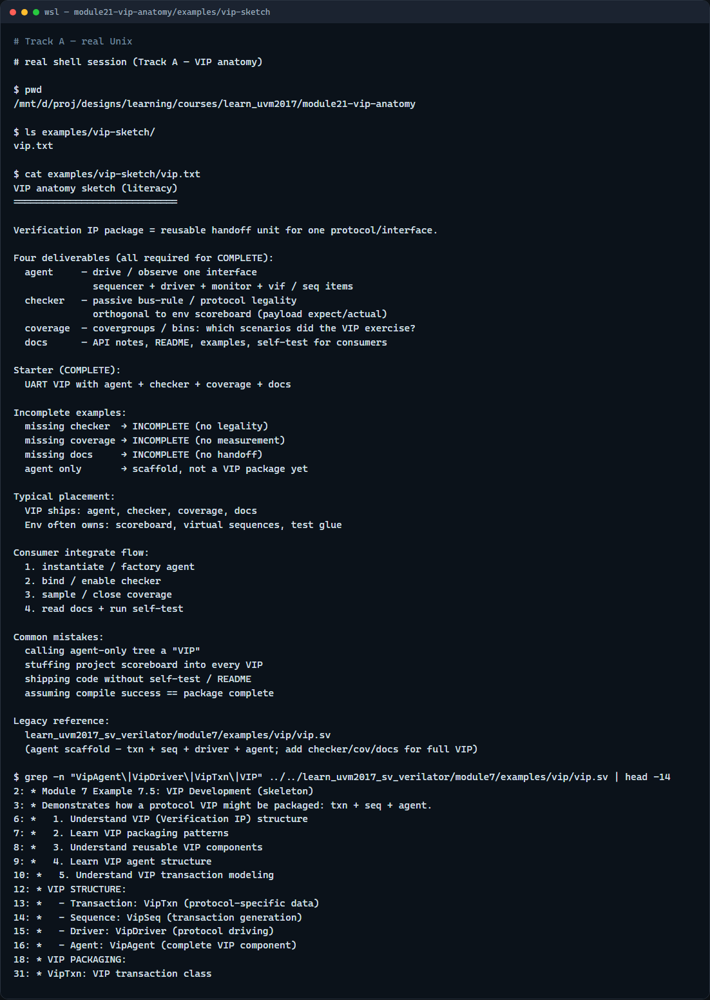

# Module 21 — VIP anatomy

**Module id:** module21-vip-anatomy  
**Lab:** vip-anatomy  
**Tracks:** A · B

## Slide 1 — VIP anatomy

An agent drives and observes one interface—but a reusable verification IP is more than an agent. A VIP package is a handoff unit: agent for the bus, protocol checker for legality, coverage for scenario measurement, and docs with a self-test so another team can integrate it. Ship only the agent and you have a scaffold, not a complete VIP. This module sketches a UART VIP with all four pieces, then removes one at a time so you see what incomplete looks like. We will assemble the package in the browser lab, then read the same checklist in offline notes.

## Slide 2 — Four deliverables

The agent is the protocol unit—sequencer, driver, monitor, and interface around one bus. The checker is passive protocol rules—handshake and legality, orthogonal to scoreboard payload checks. Coverage is covergroups and bins that measure which scenarios the VIP exercised. Docs are the handoff—API notes, README, examples, and a self-test consumers can run. Scoreboards often live in the env; VIPs commonly ship checker plus coverage with the agent. A package is complete only when all four deliverables are present and consumers can integrate without reverse-engineering your source.

## Slide 3 — Browser lab

In the browser lab track, open the VIP anatomy lab. The starter loads a complete UART VIP—agent, checker, coverage, and docs all present. Click Assemble and confirm the package reads COMPLETE. Try missing checker, missing coverage, or missing docs and see INCOMPLETE. Load agent only—useful scaffold, not a VIP package yet. Toggle pieces from empty and rebuild the handoff one deliverable at a time. Work a few challenges, then Check. The lab is literacy—you still package real SystemVerilog and docs for production VIPs.

## Slide 4 — Real UVM literacy

In the real UVM track, open this module’s VIP sketch—it lists agent, checker, coverage, and docs as a reuse checklist in plain language. Trace how an agent alone is not enough for handoff, and how checker and coverage sit beside the agent. If the in-course hello is checked out, grep for VipAgent or VIP in module seven vip—you will see a skeleton with transaction, sequence, driver, and agent. That example is the agent scaffold; real VIP packages add checker, coverage, and docs on top. Protocol checkers from the last module are one of those four pieces.

## Slide 5 — Pitfalls to watch

Do not call an agent-only tree a VIP—consumers need checker, coverage, and docs too. Do not put the project scoreboard inside the VIP by default—env owns functional expect versus actual; VIP ships protocol legality and coverage. Do not skip the self-test in docs—integration without a smoke run fails at the consumer. Do not forget that incomplete packages still compile—missing pieces are a process failure, not a syntax error. And remember: factory, ConfigDB, and sequences make the agent reusable; packaging makes the VIP shippable.

## Slide 6 — Your turn

Complete the checklist for at least one track—preferably both. In the browser, assemble the complete starter, then remove docs and explain why handoff fails. On real UVM, sketch a UART VIP tree with all four deliverables labeled. When you are ready, take the short quiz, then continue to running a course UVM example offline in the next module.
