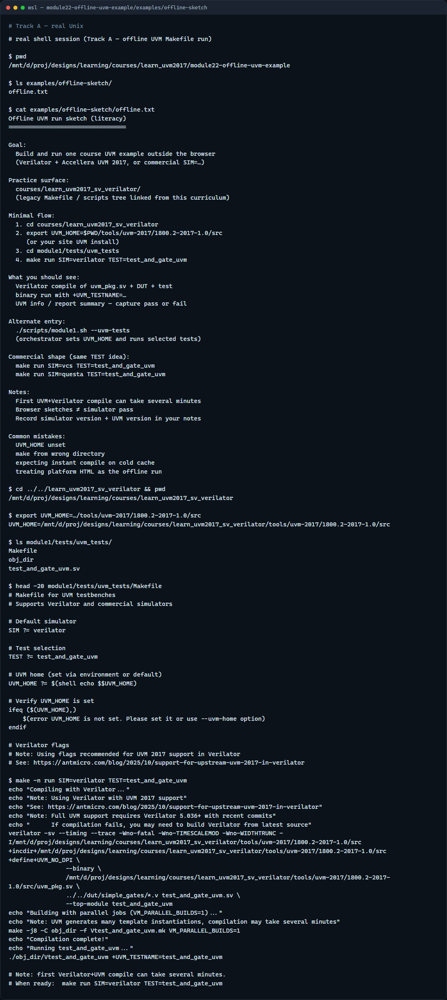

# Module 22 — Run a course UVM example

**Module id:** module22-offline-uvm-example  
**Lab:** none (offline · course Makefile)  
**Tracks:** A only

## Slide 1 — Run a course UVM example

Browser sketches taught the ideas—factory, ConfigDB, agents, sequences. This module is Track A only: you open the legacy SystemVerilog UVM course tree and build a real example with Verilator or a commercial simulator. You leave with a command line you can repeat: set UVM home, make, run, and read pass or fail. No browser lab here—just the live toolchain.

## Slide 2 — Why leave the browser

Sketches are concept literacy—they do not compile Accellera UVM or exercise Verilator flags. Offline runs force you through UVM home, include paths, plusargs like UVM test name, and the Makefile glue you will keep at work. The monorepo links the legacy SystemVerilog UVM Verilator tree for that practice surface. One clean pass on a small test is enough for this module; you can deepen later modules at your pace.

## Slide 3 — Offline workflow

Here is the rhythm. Open the legacy course next to this curriculum. Point UVM home at the Accellera library under tools—or your system install. Change into a small UVM test directory—module one and-gate is a good first target. Run make with Verilator as the simulator and the test name set. Watch compile finish, then the binary start with plus UVM test name. Capture the command and the pass or fail line in your notes. Commercial flows swap the simulator knob—same idea, different Make recipe.

## Slide 4 — Real UVM toolchain



In the real UVM track, walk the legacy tree, export UVM home, list the module one UVM tests, preview the Makefile, then compile and run the and-gate UVM test. Say the working directory aloud so you know where make runs from.

```bash
# cd learn_uvm2017_sv_verilator — enter the legacy offline course
cd courses/learn_uvm2017_sv_verilator

# export UVM_HOME — Accellera UVM 2017 src under tools/
export UVM_HOME=$PWD/tools/uvm-2017/1800.2-2017-1.0/src

# ls module1/tests/uvm_tests — find Makefile and test_and_gate_uvm.sv
ls module1/tests/uvm_tests

# make run — compile with Verilator and execute the UVM test
cd module1/tests/uvm_tests
make run SIM=verilator TEST=test_and_gate_uvm
```

## Slide 5 — Pitfalls to watch

Do not forget UVM home—Make will error before Verilator starts. Do not run make from the wrong directory—use the test folder that owns the Makefile. Do not confuse browser sketch pass with simulator pass—offline needs a real binary. Expect the first UVM Verilator compile to take several minutes; later rebuilds are faster when objects exist. And remember: commercial simulators use the same test name idea with a different SIM value—read the Makefile comments.

## Slide 6 — Your turn

Complete the offline checklist: locate a runnable example, build it, observe pass or fail, and note your simulator and UVM version. Prefer module one and-gate unless your site policy points elsewhere. When you are ready, take the short quiz, then continue to the wrap module that closes this UVM path.
