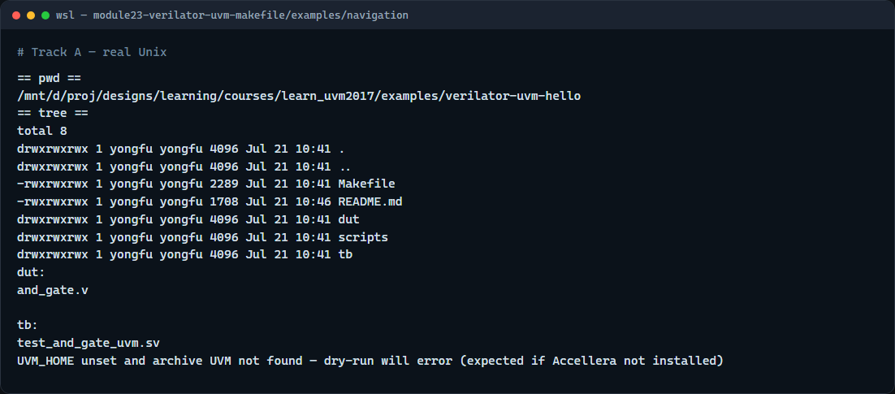

# Makefile knobs for Verilator UVM

Module twenty-two named Verilator as a plausible UVM host

---

## UVM_HOME and include paths
- Accellera UVM lives outside your DUT tree
- Point UVM home at the library **src** directory that contains `uvm_pkg.sv`
- This course does not vendor the full Accellera tree
- If UVM home is unset or wrong

---

## SIM, TEST, and UVM test name
- The simulator knob selects the Verilator recipe
- TEST names the SystemVerilog top file
- At run time the binary needs plus UVM test name matching the registered test class
- Read the in-course Makefile

---

## Read the Makefile flow


---

## Read the Makefile flow — try these

```
# cd in-course Verilator + UVM hello
cd courses/learn_uvm2017/examples/verilator-uvm-hello

# export UVM_HOME — Accellera UVM 2017 src (uvm_pkg.sv lives here)
export UVM_HOME=/path/to/1800.2-2017-1.0/src

# ls — confirm Makefile, dut/and_gate.v, tb/test_and_gate_uvm.sv
ls
ls dut tb

# make dry-run — verify UVM_HOME and sources without compiling
make dry-run

```

---

## Common fail modes
- Wrong or missing UVM home is the fastest failure
- Running make from the wrong directory misses the Makefile
- Missing Verilator on PATH fails at compile
- Mismatch between top module and plus UVM test name yields no tests executed
- First cold compiles take minutes, that is normal
- Browser sketch success never substitutes for reading these Makefile errors offline

---

## Your turn
- Complete the checklist
- When you are ready

