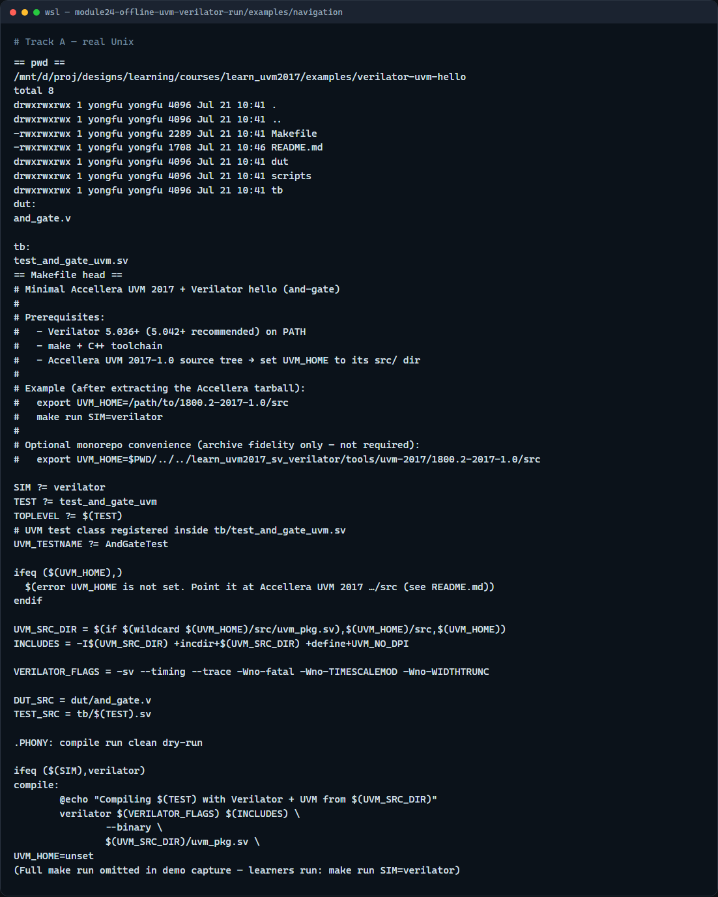

# Run UVM on Verilator

Modules twenty-two and twenty-three moved you from host literacy to Makefile knobs

---

## Verilator-first offline run
- Browser sketches taught factory, agents, and sequences, they do not compile uvm_pkg
- Offline you use the in-course Makefile: export UVM home, make run with Verilator
- The flow compiles uvm_pkg plus DUT plus test into a C++ executable
- First cold compile can take many minutes; later rebuilds reuse objects

---

## Offline workflow
- Open examples verilator-uvm-hello beside this curriculum
- Export UVM home to Accellera src
- Run make dry-run if you skipped module twenty-three
- Then make run
- Watch Verilator compile stages finish, then the binary print UVM info and a report summary
- Capture the exact command and the pass or fail line

---

## Real Verilator UVM run


---

## Real Verilator UVM run — try these

```
# cd in-course Verilator + UVM hello
cd courses/learn_uvm2017/examples/verilator-uvm-hello

# export UVM_HOME — Accellera UVM 2017 src/
export UVM_HOME=/path/to/1800.2-2017-1.0/src

# make run — Verilator compile + execute +UVM_TESTNAME=AndGateTest
make run SIM=verilator

```

---

## Pitfalls to watch
- Unset UVM home fails before useful compile output
- A browser UVM sketch pass is not a Verilator UVM pass
- Patience on first compile, UVM templates are heavy
- If Verilator is too old for UVM twenty seventeen, upgrade or note the version blocker
- Keep the ignored legacy archive out of your default path

---

## Your turn
- Complete the checklist: dry-run green, make run finished, pass or fail recorded
- Prefer the in-course and-gate hello unless your site policy points elsewhere
- When you are ready, take the short quiz, then continue to the wrap module

